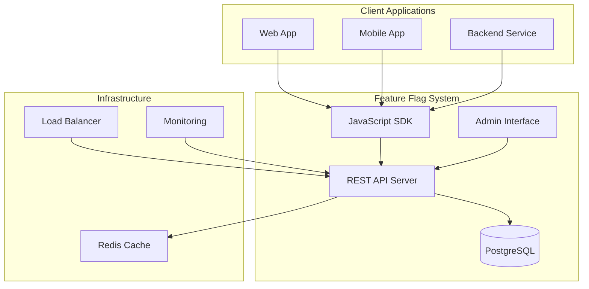
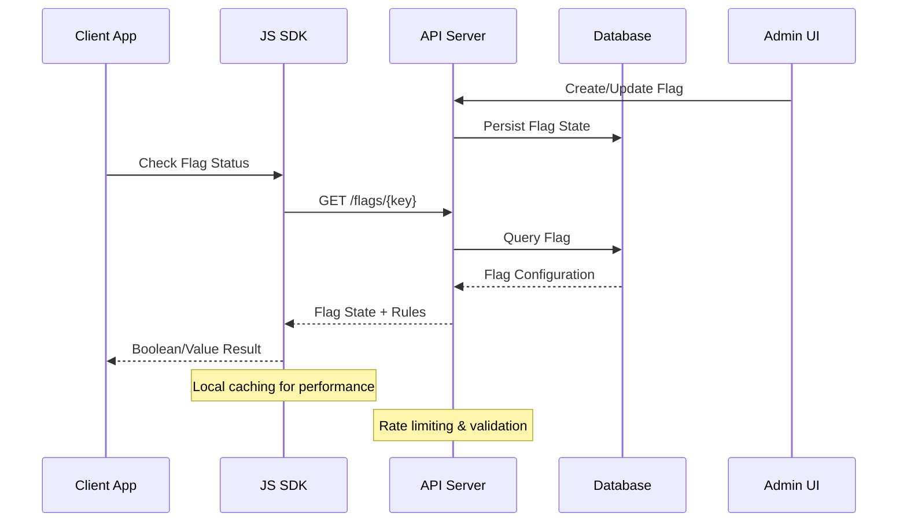
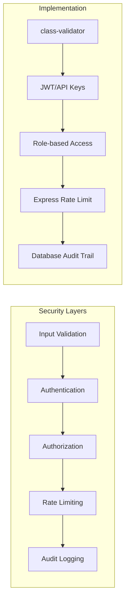

# Feature Flags Management System

A comprehensive, production-ready feature flag management platform designed to enable continuous deployment while maintaining granular control over feature visibility. This system embodies modern software engineering principles, providing a robust foundation for feature toggles, A/B testing, and progressive feature rollouts in distributed applications.

## Project Philosophy & Ideation

### The Problem We Solved

Modern software development faces a fundamental challenge: how to deploy code frequently while minimizing risk and maintaining control over feature exposure. Traditional deployment strategies often couple code deployment with feature releases, creating bottlenecks and increasing the blast radius of potential issues.

Our feature flag system addresses this by decoupling deployment from release, enabling:

- **Risk Mitigation**: Deploy code with features disabled, then enable selectively
- **Progressive Rollouts**: Gradually expose features to increasing user segments  
- **Instant Rollbacks**: Disable problematic features without code deployments
- **A/B Testing**: Compare feature variants with statistical confidence
- **Environment Parity**: Maintain consistent codebases across environments while varying feature availability

### Design Philosophy

Our architecture is built on several core principles:

| Principle | Implementation | Benefit |
|-----------|----------------|---------|
| **Separation of Concerns** | Distinct server, client, and SDK components | Independent scaling and deployment |
| **API-First Design** | RESTful API with comprehensive OpenAPI documentation | Language-agnostic integration |
| **Type Safety** | TypeScript throughout the stack | Reduced runtime errors and better DX |
| **Production Readiness** | Comprehensive testing, monitoring, and security | Enterprise-grade reliability |
| **Developer Experience** | Intuitive APIs, clear documentation, modern tooling | Faster adoption and integration |
| **Scalability** | Stateless design with efficient data access patterns | Horizontal scaling capability |

## Table of Contents

- [Overview](#overview)
- [Architecture](#architecture)
- [Components](#components)
  - [Application Server](#application-server)
  - [Application Client](#application-client)
  - [JavaScript SDK](#javascript-sdk)
  - [Test Application](#test-application)
- [Technology Stack](#technology-stack)
- [Getting Started](#getting-started)
- [Development](#development)
- [API Documentation](#api-documentation)
- [Testing](#testing)
- [Database](#database)
- [Deployment](#deployment)
- [License](#license)

## Overview

This feature flag system provides a comprehensive solution for managing feature toggles across distributed applications. The platform consists of a robust backend service built with NestJS, a modern React-based administrative interface, a JavaScript SDK for client integration, and testing utilities.

The system supports:

- Dynamic feature flag creation and management
- Real-time flag state updates
- User targeting and segmentation
- A/B testing capabilities
- Audit logging and flag history
- RESTful API with Swagger documentation
- Production-grade security and performance

## System Architecture

### Architectural Overview

Our feature flag system employs a microservices-inspired architecture within a monorepo structure, balancing the benefits of modular design with simplified development workflows.



### Component Architecture

| Component | Purpose | Technology Stack | Deployment Unit |
|-----------|---------|------------------|-----------------|
| **app-server** | Core API and business logic | NestJS, TypeORM, PostgreSQL | Docker container |
| **app-client** | Administrative interface | React, Vite, TypeScript | Static assets (CDN) |
| **sdk-js** | Client integration library | TypeScript, Rollup | NPM package |
| **app-test** | Integration testing | Node.js, HTML | Development only |

### Design Decisions & Rationale

#### Monorepo Structure
We chose a monorepo approach for several strategic reasons:

- **Shared Dependencies**: Common TypeScript types and interfaces across components
- **Atomic Changes**: Coordinated updates across API, client, and SDK
- **Simplified CI/CD**: Single repository for all related components
- **Developer Productivity**: Unified development environment and tooling

#### Technology Selection

**Backend: NestJS + TypeORM + PostgreSQL**
- **NestJS**: Provides enterprise-grade architecture with dependency injection, decorators, and modular design
- **TypeORM**: Type-safe database operations with migration support
- **PostgreSQL**: ACID compliance, JSON support for flexible flag configurations, and proven scalability

**Frontend: React + Vite + TypeScript**
- **React**: Component-based architecture for maintainable UI
- **Vite**: Fast development builds and optimized production bundles
- **TypeScript**: Type safety and enhanced developer experience

**SDK: Pure TypeScript + Rollup**
- **Zero Dependencies**: Minimal bundle size impact on client applications
- **Universal Module Support**: Works in browsers, Node.js, and various bundlers
- **Tree Shaking**: Optimized for modern build tools

### Data Flow Architecture



### Scalability Considerations

Our architecture supports horizontal scaling through several design patterns:

| Pattern | Implementation | Scaling Benefit |
|---------|----------------|-----------------|
| **Stateless API** | No server-side sessions | Load balancer friendly |
| **Database Connection Pooling** | TypeORM connection management | Efficient resource utilization |
| **Caching Strategy** | Redis for frequently accessed flags | Reduced database load |
| **CDN Distribution** | Static client assets | Global performance |
| **SDK Caching** | Client-side flag caching with TTL | Reduced API calls |

### Security Architecture

Security is implemented at multiple layers:



## Components

### Application Server

The backend service is built using NestJS, a progressive Node.js framework that provides a robust architecture for building scalable server-side applications.

#### Key Features

- **RESTful API**: Comprehensive endpoints for flag management, user administration, and analytics
- **Database Integration**: TypeORM with PostgreSQL for reliable data persistence
- **API Documentation**: Automated Swagger/OpenAPI documentation
- **Health Checks**: Built-in health monitoring using NestJS Terminus
- **Security**: Helmet integration for HTTP security headers
- **Validation**: Class-validator and class-transformer for request validation
- **Configuration Management**: Environment-based configuration with validation
- **Migration System**: Database migration support for version control

#### Technology Stack

- **Framework**: NestJS 11.x
- **Database ORM**: TypeORM 0.3.x
- **Database**: PostgreSQL
- **Documentation**: Swagger UI Express
- **Validation**: class-validator, class-transformer
- **Security**: Helmet
- **Configuration**: @nestjs/config with Joi validation

#### Available Scripts

```bash
npm run start:dev      # Start development server with hot reload
npm run start:prod     # Start production server
npm run build          # Build for production
npm run test           # Run unit tests
npm run test:e2e       # Run end-to-end tests
npm run test:cov       # Generate test coverage report
npm run migration:generate  # Generate new database migration
npm run migration:run       # Execute pending migrations
npm run migration:revert    # Revert last migration
npm run lint           # Lint and fix code
npm run format         # Format code with Prettier
```

#### Configuration

The server requires environment variables for configuration. Create a `.env` file based on `.env.example`:

- Database connection parameters
- Server port and host configuration
- CORS settings
- JWT secrets (if authentication is implemented)
- Feature flag defaults

#### Database Migrations

The server includes a comprehensive migration system for database schema management:

```bash
# Generate a new migration after entity changes
npm run migration:generate -- migrations/MigrationName

# Run all pending migrations
npm run migration:run

# Revert the last migration
npm run migration:revert
```

### Application Client

A modern, responsive web application built with React and Vite, providing an intuitive interface for feature flag administration.

#### Key Features

- **Flag Management Interface**: Create, update, and delete feature flags
- **Real-time Updates**: Live flag state monitoring
- **User-friendly Dashboard**: Comprehensive overview of all flags
- **Environment Support**: Separate development and production configurations
- **Modern UI**: Built with React 19 and Lucide React icons
- **Fast Development**: Vite for instant hot module replacement

#### Technology Stack

- **Framework**: React 19.x
- **Build Tool**: Vite 7.x
- **Icons**: Lucide React
- **Testing**: Vitest with React Testing Library
- **Language**: TypeScript 5.9.x

#### Available Scripts

```bash
npm run dev        # Start development server
npm run build      # Build for production
npm run preview    # Preview production build
npm run test       # Run tests with Vitest
npm run lint       # Lint code
```

#### Configuration

Environment-specific configuration files are provided:

- `.env.development`: Development environment settings
- `.env.production`: Production environment settings
- `.env.example`: Template for environment variables

Configure the API endpoint to connect to the backend server.

### JavaScript SDK

A fully-featured SDK for integrating feature flags into JavaScript and TypeScript applications. The SDK is published as `@flagsystem/js-sdk` and supports both CommonJS and ES modules.

#### Key Features

- **Universal Module Support**: CommonJS and ES Module builds
- **TypeScript Support**: Full type definitions included
- **Zero Dependencies**: Lightweight implementation
- **Tree-shakeable**: Optimized for modern bundlers
- **Browser and Node.js**: Works in both environments
- **Comprehensive Testing**: Full test coverage

#### Technology Stack

- **Language**: TypeScript 5.3.x
- **Build Tool**: Rollup
- **Testing**: Jest with ts-jest
- **Linting**: ESLint with TypeScript support

#### Installation

```bash
npm install @flagsystem/js-sdk
```

#### Available Scripts

```bash
npm run build          # Build all distribution formats
npm run build:esm      # Build ES modules
npm run build:cjs      # Build CommonJS modules
npm run build:types    # Generate TypeScript declarations
npm run test           # Run tests
npm run test:watch     # Run tests in watch mode
npm run test:coverage  # Generate coverage report
npm run lint           # Lint code
npm run lint:fix       # Lint and fix code
npm run clean          # Remove build artifacts
```

#### Build Output

The SDK generates three distribution formats:

- **ESM**: `dist/esm/index.js` - ES modules for modern bundlers
- **CommonJS**: `dist/cjs/index.js` - CommonJS for Node.js
- **Types**: `dist/types/index.d.ts` - TypeScript type definitions

#### Package Exports

The package.json includes modern export mappings for optimal module resolution:

```json
{
  "exports": {
    ".": {
      "import": "./dist/esm/index.js",
      "require": "./dist/cjs/index.js",
      "types": "./dist/types/index.d.ts"
    }
  }
}
```

### Test Application

A simple testing harness for validating SDK integration and feature flag functionality in a browser environment.

#### Components

- **index.html**: Interactive test interface for SDK validation
- **server.js**: Simple HTTP server for serving the test application

This component provides a sandbox environment for testing feature flag behavior before integration into production applications.

## Technology Stack

### Backend

- **Runtime**: Node.js
- **Framework**: NestJS 11.x
- **Language**: TypeScript 5.7.x
- **Database**: PostgreSQL
- **ORM**: TypeORM 0.3.x
- **API Documentation**: Swagger/OpenAPI
- **Testing**: Jest 30.x with Supertest

### Frontend

- **Framework**: React 19.x
- **Build Tool**: Vite 7.x
- **Language**: TypeScript 5.9.x
- **Testing**: Vitest 4.x with React Testing Library
- **UI Icons**: Lucide React

### SDK

- **Language**: TypeScript 5.3.x
- **Build Tool**: Rollup 4.x
- **Testing**: Jest 29.x
- **Module Formats**: ESM and CommonJS

### Development Tools

- **Linting**: ESLint 9.x
- **Formatting**: Prettier 3.x
- **Type Checking**: TypeScript
- **Version Control**: Git

## Getting Started

### Prerequisites

- Node.js (version 18.x or higher recommended)
- npm or yarn package manager
- PostgreSQL database (for app-server)
- Git

### Installation

1. Clone the repository:

```bash
git clone https://github.com/kedarvartak/feature-flags.git
cd feature-flags
```

2. Install server dependencies:

```bash
cd app-server
npm install
cp .env.example .env
# Configure database credentials in .env
```

3. Install client dependencies:

```bash
cd ../app-client
npm install
cp .env.example .env
# Configure API endpoint in .env
```

4. Install SDK dependencies (for development):

```bash
cd ../sdk-js
npm install
```

### Database Setup

1. Create a PostgreSQL database for the application
2. Update database credentials in `app-server/.env`
3. Run migrations:

```bash
cd app-server
npm run migration:run
```

### Running the Application

1. Start the backend server:

```bash
cd app-server
npm run start:dev
```

The server will start on the configured port (default: http://localhost:3000)

2. Start the frontend client:

```bash
cd app-client
npm run dev
```

The client will start on the Vite default port (default: http://localhost:5173)

3. Access the Swagger API documentation:

Navigate to http://localhost:3000/api/docs (or your configured server URL)

## Development

### Code Quality

The project maintains high code quality standards through:

- **TypeScript**: Strong typing throughout the codebase
- **ESLint**: Automated code linting with TypeScript support
- **Prettier**: Consistent code formatting
- **Testing**: Comprehensive unit and integration tests
- **Type Safety**: Strict TypeScript compiler settings

### Project Structure

#### Server Structure

```
app-server/
├── src/
│   ├── config/           # Configuration files and TypeORM setup
│   ├── modules/          # Feature modules
│   ├── common/           # Shared utilities and decorators
│   └── main.ts           # Application entry point
├── test/                 # E2E tests
├── migrations/           # Database migrations
└── dist/                 # Compiled output
```

#### Client Structure

```
app-client/
├── src/
│   ├── components/       # React components
│   ├── pages/            # Page components
│   ├── services/         # API service layer
│   ├── hooks/            # Custom React hooks
│   └── App.tsx           # Root component
└── public/               # Static assets
```

#### SDK Structure

```
sdk-js/
├── src/
│   ├── client/           # SDK client implementation
│   ├── types/            # TypeScript type definitions
│   └── index.ts          # Main entry point
└── dist/                 # Compiled distributions
```

## API Documentation

The server provides automated API documentation through Swagger/OpenAPI. Access the interactive documentation at:

```
http://localhost:3000/api/docs
```

The documentation includes:

- All available endpoints
- Request/response schemas
- Authentication requirements
- Example requests and responses
- Data models and DTOs

Swagger configuration can be verified using the included verification script:

```bash
cd app-server
node verify-swagger.js
```

## Testing

### Server Testing

```bash
cd app-server

# Run unit tests
npm run test

# Run tests in watch mode
npm run test:watch

# Generate coverage report
npm run test:cov

# Run E2E tests
npm run test:e2e
```

The server includes specialized test scripts:

- `run-e2e-tests.sh`: Automated E2E test execution
- `test-cors.sh`: CORS configuration validation
- `test-connection-pool.js`: Database connection pool testing

### Client Testing

```bash
cd app-client

# Run tests with Vitest
npm run test
```

### SDK Testing

```bash
cd sdk-js

# Run tests
npm run test

# Run tests in watch mode
npm run test:watch

# Generate coverage report
npm run test:coverage
```

## Database

The system uses PostgreSQL with TypeORM for data persistence. The database schema is managed through migrations, ensuring version control and consistent deployments.

### Migration Workflow

1. Modify entity definitions in the source code
2. Generate a migration: `npm run migration:generate -- migrations/DescriptiveName`
3. Review the generated migration file
4. Run migrations: `npm run migration:run`
5. If needed, revert: `npm run migration:revert`

### Connection Pooling

The server includes connection pool monitoring and optimization. Test pool configuration:

```bash
cd app-server
node test-connection-pool.js
```

## Deployment

### Server Deployment

1. Build the application:

```bash
cd app-server
npm run build
```

2. Set production environment variables
3. Run migrations:

```bash
npm run migration:run
```

4. Start the production server:

```bash
npm run start:prod
```

### Client Deployment

1. Build the production bundle:

```bash
cd app-client
npm run build
```

2. The optimized static files will be in the `dist` directory
3. Serve using any static file server or CDN

### SDK Publishing

The SDK is configured for npm publication:

```bash
cd sdk-js
npm run prepublishOnly  # Runs build and tests automatically
npm publish
```

## Security

### Server Security

- Helmet middleware for HTTP header security
- CORS configuration for cross-origin requests
- Input validation using class-validator
- Environment variable validation with Joi
- Prepared statements via TypeORM (SQL injection prevention)

### Configuration Security

- Sensitive credentials stored in environment variables
- `.env` files excluded from version control
- `.env.example` templates provided for reference

## CORS Configuration

The server includes comprehensive CORS testing:

```bash
cd app-server
./test-cors.sh
```

This validates cross-origin request handling and security policies.

## License

This project's license information can be found in the LICENSE file. The SDK component uses the MIT License as specified in `sdk-js/LICENSE`.

## Support and Contributions

For issues, feature requests, or contributions, please refer to the repository's issue tracker at https://github.com/kedarvartak/feature-flags/issues.

When contributing:

1. Ensure all tests pass
2. Follow the existing code style
3. Update documentation as needed
4. Add tests for new features
5. Run linting and formatting before committing

## Additional Resources

- NestJS Documentation: https://docs.nestjs.com
- React Documentation: https://react.dev
- TypeORM Documentation: https://typeorm.io
- Vite Documentation: https://vitejs.dev
