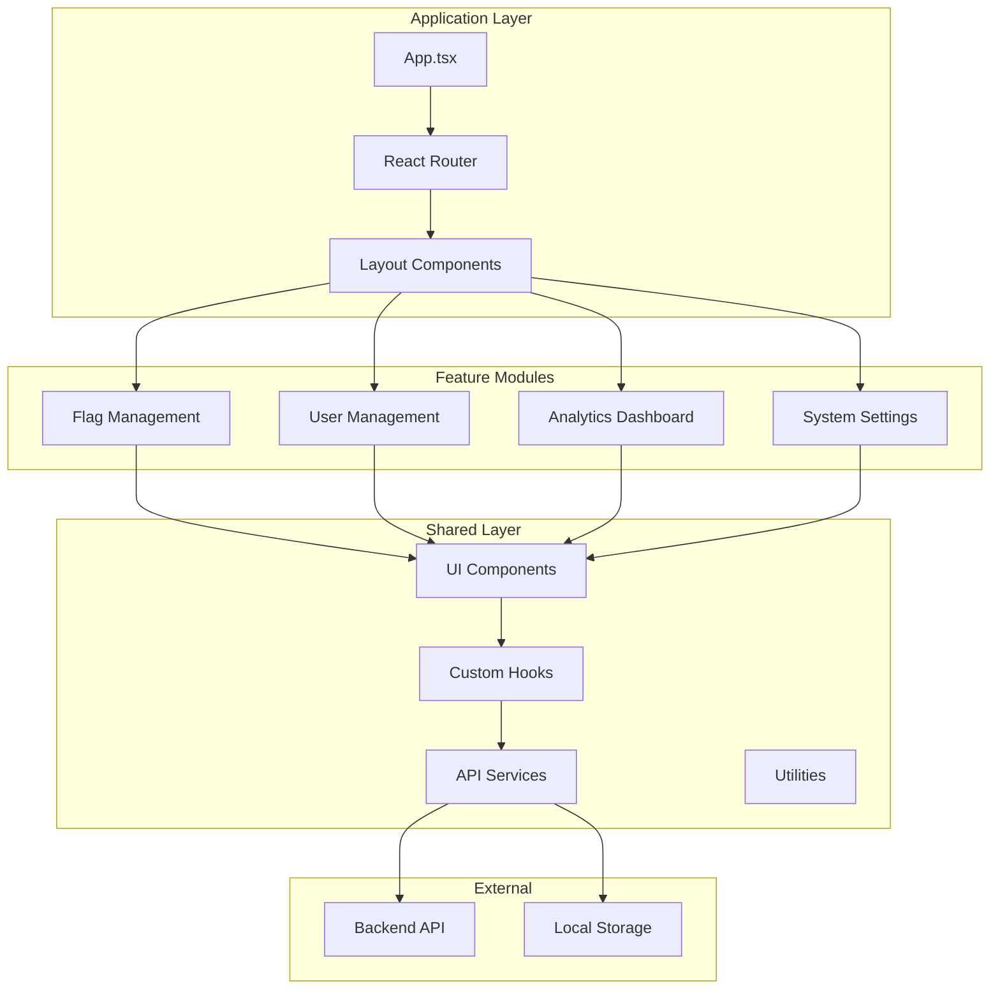

# Feature Flags Admin Client

A modern, responsive administrative interface for managing feature flags, built with React 19, Vite, and TypeScript. This application provides an intuitive dashboard for creating, managing, and monitoring feature flags across different environments.

## Table of Contents

- [Project Philosophy](#project-philosophy)
- [Architecture & Design Patterns](#architecture--design-patterns)
- [Project Structure](#project-structure)
- [Technology Stack](#technology-stack)
- [Development Practices](#development-practices)
- [Component Design](#component-design)
- [State Management](#state-management)
- [Performance Optimizations](#performance-optimizations)
- [Testing Strategy](#testing-strategy)
- [Build & Deployment](#build--deployment)
- [Best Practices](#best-practices)

## Project Philosophy

### Design Principles

Our client application is built around several core principles that ensure maintainability, performance, and user experience:

| Principle | Implementation | Benefit |
|-----------|----------------|---------|
| **Component Composition** | Small, focused components with clear responsibilities | Reusability and testability |
| **Type Safety** | Comprehensive TypeScript usage with strict settings | Reduced runtime errors |
| **Performance First** | Code splitting, lazy loading, and optimized bundles | Fast loading and smooth UX |
| **Accessibility** | WCAG 2.1 AA compliance throughout | Inclusive user experience |
| **Mobile Responsive** | Mobile-first design approach | Consistent experience across devices |
| **Developer Experience** | Hot reload, clear error messages, intuitive APIs | Faster development cycles |

### User Experience Goals

The admin interface is designed with specific UX objectives:

- **Intuitive Navigation**: Clear information hierarchy and logical flow
- **Real-time Feedback**: Immediate visual feedback for all user actions
- **Error Prevention**: Form validation and confirmation dialogs for destructive actions
- **Efficient Workflows**: Minimal clicks to complete common tasks
- **Visual Clarity**: Clean design with appropriate use of color and typography

## Architecture & Design Patterns

### Component Architecture



### Design Patterns Used

#### 1. Container/Presentational Pattern
We separate business logic from presentation:

```typescript
// Container Component (Smart)
const FlagListContainer: React.FC = () => {
  const { flags, loading, error } = useFlagList();
  const { deleteFlag } = useFlagActions();
  
  return (
    <FlagList 
      flags={flags}
      loading={loading}
      error={error}
      onDelete={deleteFlag}
    />
  );
};

// Presentational Component (Dumb)
interface FlagListProps {
  flags: Flag[];
  loading: boolean;
  error: string | null;
  onDelete: (id: string) => void;
}

const FlagList: React.FC<FlagListProps> = ({ flags, loading, error, onDelete }) => {
  // Pure presentation logic only
};
```

#### 2. Custom Hooks Pattern
Encapsulate reusable stateful logic:

```typescript
// Custom hook for flag management
const useFlagList = () => {
  const [flags, setFlags] = useState<Flag[]>([]);
  const [loading, setLoading] = useState(true);
  const [error, setError] = useState<string | null>(null);
  
  // Implementation details...
  
  return { flags, loading, error, refetch };
};
```

#### 3. Compound Component Pattern
For complex UI components with multiple parts:

```typescript
const Modal = ({ children, isOpen, onClose }) => {
  // Modal logic
};

Modal.Header = ({ children }) => <div className="modal-header">{children}</div>;
Modal.Body = ({ children }) => <div className="modal-body">{children}</div>;
Modal.Footer = ({ children }) => <div className="modal-footer">{children}</div>;

// Usage
<Modal isOpen={isOpen} onClose={handleClose}>
  <Modal.Header>Delete Flag</Modal.Header>
  <Modal.Body>Are you sure you want to delete this flag?</Modal.Body>
  <Modal.Footer>
    <Button onClick={handleConfirm}>Delete</Button>
    <Button onClick={handleClose}>Cancel</Button>
  </Modal.Footer>
</Modal>
```

## Project Structure

```
app-client/
├── public/                     # Static assets
│   ├── favicon.ico
│   └── manifest.json
├── src/
│   ├── components/             # Reusable UI components
│   │   ├── ui/                # Base UI components (Button, Input, etc.)
│   │   ├── forms/             # Form-specific components
│   │   ├── layout/            # Layout components (Header, Sidebar, etc.)
│   │   └── common/            # Common business components
│   ├── pages/                 # Page-level components
│   │   ├── flags/             # Flag management pages
│   │   ├── users/             # User management pages
│   │   ├── analytics/         # Analytics dashboard
│   │   └── settings/          # Settings pages
│   ├── hooks/                 # Custom React hooks
│   │   ├── api/               # API-related hooks
│   │   ├── ui/                # UI-related hooks
│   │   └── utils/             # Utility hooks
│   ├── services/              # API service layer
│   │   ├── api.ts             # Base API configuration
│   │   ├── flags.ts           # Flag-related API calls
│   │   ├── users.ts           # User-related API calls
│   │   └── analytics.ts       # Analytics API calls
│   ├── types/                 # TypeScript type definitions
│   │   ├── api.ts             # API response types
│   │   ├── flags.ts           # Flag-related types
│   │   └── common.ts          # Common types
│   ├── utils/                 # Utility functions
│   │   ├── validation.ts      # Form validation utilities
│   │   ├── formatting.ts      # Data formatting utilities
│   │   └── constants.ts       # Application constants
│   ├── styles/                # Global styles and themes
│   │   ├── globals.css        # Global CSS
│   │   ├── variables.css      # CSS custom properties
│   │   └── components.css     # Component-specific styles
│   ├── App.tsx                # Root application component
│   ├── main.tsx               # Application entry point
│   └── vite-env.d.ts          # Vite type definitions
├── .env.development           # Development environment variables
├── .env.production            # Production environment variables
├── .env.example               # Environment variables template
├── index.html                 # HTML template
├── package.json               # Dependencies and scripts
├── tsconfig.json              # TypeScript configuration
├── tsconfig.app.json          # App-specific TypeScript config
├── tsconfig.node.json         # Node-specific TypeScript config
├── vite.config.ts             # Vite configuration
├── vitest.config.ts           # Vitest configuration
└── eslint.config.js           # ESLint configuration
```

### Directory Organization Principles

#### 1. Feature-Based Organization
Pages are organized by feature domain rather than technical concerns:

```
pages/
├── flags/
│   ├── FlagList.tsx
│   ├── FlagDetail.tsx
│   ├── CreateFlag.tsx
│   └── EditFlag.tsx
└── users/
    ├── UserList.tsx
    ├── UserDetail.tsx
    └── CreateUser.tsx
```

#### 2. Layered Architecture
Clear separation between presentation, business logic, and data access:

| Layer | Directory | Responsibility |
|-------|-----------|----------------|
| **Presentation** | `components/`, `pages/` | UI rendering and user interaction |
| **Business Logic** | `hooks/`, `utils/` | Application logic and state management |
| **Data Access** | `services/` | API communication and data transformation |
| **Types** | `types/` | Type definitions and interfaces |

#### 3. Atomic Design Principles
Components are organized from atomic to complex:

```
components/
├── ui/                    # Atoms (Button, Input, Icon)
├── forms/                 # Molecules (FormField, SearchBox)
├── layout/                # Organisms (Header, Sidebar)
└── common/                # Templates (DataTable, Modal)
```

## Technology Stack

### Core Technologies

| Technology | Version | Purpose | Rationale |
|------------|---------|---------|-----------|
| **React** | 19.x | UI Framework | Latest features, concurrent rendering, improved performance |
| **TypeScript** | 5.9.x | Type System | Type safety, better IDE support, reduced runtime errors |
| **Vite** | 7.x | Build Tool | Fast HMR, optimized builds, modern ES modules |
| **Vitest** | 4.x | Testing Framework | Native Vite integration, fast execution, Jest compatibility |

### Supporting Libraries

| Library | Purpose | Why Chosen |
|---------|---------|------------|
| **Lucide React** | Icons | Lightweight, consistent design, tree-shakeable |
| **React Router** | Routing | Standard React routing solution, type-safe |
| **Axios** | HTTP Client | Request/response interceptors, automatic JSON parsing |
| **React Hook Form** | Form Management | Performance-focused, minimal re-renders |
| **Zod** | Schema Validation | Type-safe validation, great TypeScript integration |

### Development Tools

| Tool | Configuration | Purpose |
|------|---------------|---------|
| **ESLint** | `eslint.config.js` | Code linting and style enforcement |
| **Prettier** | `.prettierrc` | Code formatting |
| **TypeScript** | `tsconfig.json` | Type checking and compilation |
| **Vite** | `vite.config.ts` | Build configuration and dev server |

## Development Practices

### Code Quality Standards

#### 1. TypeScript Configuration
We use strict TypeScript settings for maximum type safety:

```json
{
  "compilerOptions": {
    "strict": true,
    "noUncheckedIndexedAccess": true,
    "noImplicitReturns": true,
    "noFallthroughCasesInSwitch": true,
    "exactOptionalPropertyTypes": true
  }
}
```

#### 2. ESLint Rules
Custom ESLint configuration enforces consistent code style:

```javascript
export default [
  {
    rules: {
      '@typescript-eslint/no-unused-vars': 'error',
      'react-hooks/exhaustive-deps': 'warn',
      'prefer-const': 'error',
      'no-var': 'error'
    }
  }
];
```

#### 3. Import Organization
Consistent import ordering and grouping:

```typescript
// 1. React and React-related imports
import React, { useState, useEffect } from 'react';
import { useNavigate } from 'react-router-dom';

// 2. Third-party libraries
import { Loader2, Plus } from 'lucide-react';

// 3. Internal imports (absolute paths)
import { Button } from '@/components/ui/Button';
import { useFlagList } from '@/hooks/api/useFlagList';

// 4. Relative imports
import './FlagList.css';
```

### Component Development Guidelines

#### 1. Component Structure Template

```typescript
import React from 'react';
import { ComponentProps } from './ComponentName.types';
import './ComponentName.css';

/**
 * ComponentName - Brief description of what this component does
 * 
 * @param props - Component properties
 * @returns JSX element
 */
export const ComponentName: React.FC<ComponentProps> = ({
  prop1,
  prop2,
  onAction,
  ...restProps
}) => {
  // Hooks (useState, useEffect, custom hooks)
  const [state, setState] = useState(initialValue);
  
  // Event handlers
  const handleAction = (event: React.MouseEvent) => {
    // Handler logic
    onAction?.(event);
  };
  
  // Early returns for loading/error states
  if (loading) return <LoadingSpinner />;
  if (error) return <ErrorMessage error={error} />;
  
  // Main render
  return (
    <div className="component-name" {...restProps}>
      {/* Component content */}
    </div>
  );
};

// Default export for lazy loading
export default ComponentName;
```

#### 2. Props Interface Design

```typescript
// Base props interface
interface BaseComponentProps {
  className?: string;
  children?: React.ReactNode;
  'data-testid'?: string;
}

// Specific component props
interface ComponentProps extends BaseComponentProps {
  // Required props first
  title: string;
  items: Item[];
  
  // Optional props
  loading?: boolean;
  error?: string | null;
  
  // Event handlers
  onItemClick?: (item: Item) => void;
  onItemDelete?: (id: string) => void;
}
```

### State Management Patterns

#### 1. Local State with useState
For component-specific state:

```typescript
const [formData, setFormData] = useState<FormData>({
  name: '',
  description: '',
  enabled: false
});

const updateFormField = (field: keyof FormData, value: any) => {
  setFormData(prev => ({ ...prev, [field]: value }));
};
```

#### 2. Server State with Custom Hooks
For API data management:

```typescript
const useFlagList = () => {
  const [flags, setFlags] = useState<Flag[]>([]);
  const [loading, setLoading] = useState(true);
  const [error, setError] = useState<string | null>(null);
  
  const fetchFlags = useCallback(async () => {
    try {
      setLoading(true);
      setError(null);
      const response = await flagService.getFlags();
      setFlags(response.data);
    } catch (err) {
      setError(err instanceof Error ? err.message : 'Unknown error');
    } finally {
      setLoading(false);
    }
  }, []);
  
  useEffect(() => {
    fetchFlags();
  }, [fetchFlags]);
  
  return { flags, loading, error, refetch: fetchFlags };
};
```

#### 3. Global State with Context
For application-wide state:

```typescript
interface AppContextType {
  user: User | null;
  theme: 'light' | 'dark';
  notifications: Notification[];
}

const AppContext = createContext<AppContextType | null>(null);

export const useAppContext = () => {
  const context = useContext(AppContext);
  if (!context) {
    throw new Error('useAppContext must be used within AppProvider');
  }
  return context;
};
```

## Component Design

### UI Component Library

We maintain a consistent design system through reusable UI components:

#### 1. Base Components

| Component | Purpose | Props | Usage |
|-----------|---------|-------|-------|
| **Button** | User actions | `variant`, `size`, `loading`, `disabled` | Primary actions, form submissions |
| **Input** | Text input | `type`, `placeholder`, `error`, `required` | Form fields, search boxes |
| **Modal** | Overlays | `isOpen`, `onClose`, `size` | Confirmations, forms |
| **Table** | Data display | `columns`, `data`, `loading` | Lists, data grids |

#### 2. Component Composition Example

```typescript
// Compound component for data tables
const DataTable = ({ data, columns, loading }) => {
  return (
    <div className="data-table">
      <Table>
        <Table.Header>
          {columns.map(column => (
            <Table.HeaderCell key={column.key}>
              {column.title}
            </Table.HeaderCell>
          ))}
        </Table.Header>
        <Table.Body>
          {loading ? (
            <Table.LoadingRow colSpan={columns.length} />
          ) : (
            data.map(row => (
              <Table.Row key={row.id}>
                {columns.map(column => (
                  <Table.Cell key={column.key}>
                    {column.render ? column.render(row) : row[column.key]}
                  </Table.Cell>
                ))}
              </Table.Row>
            ))
          )}
        </Table.Body>
      </Table>
    </div>
  );
};
```

### Form Handling

#### 1. Form Component Pattern

```typescript
interface FormProps<T> {
  initialValues: T;
  validationSchema: ZodSchema<T>;
  onSubmit: (values: T) => Promise<void>;
  children: (props: FormRenderProps<T>) => React.ReactNode;
}

const Form = <T,>({ initialValues, validationSchema, onSubmit, children }: FormProps<T>) => {
  const [values, setValues] = useState(initialValues);
  const [errors, setErrors] = useState<Record<string, string>>({});
  const [isSubmitting, setIsSubmitting] = useState(false);
  
  const handleSubmit = async (e: React.FormEvent) => {
    e.preventDefault();
    
    try {
      setIsSubmitting(true);
      const validatedValues = validationSchema.parse(values);
      await onSubmit(validatedValues);
    } catch (error) {
      if (error instanceof ZodError) {
        setErrors(formatZodErrors(error));
      }
    } finally {
      setIsSubmitting(false);
    }
  };
  
  return (
    <form onSubmit={handleSubmit}>
      {children({ values, errors, isSubmitting, setValues })}
    </form>
  );
};
```

#### 2. Form Usage Example

```typescript
const CreateFlagForm = () => {
  const navigate = useNavigate();
  
  const handleSubmit = async (values: CreateFlagFormData) => {
    await flagService.createFlag(values);
    navigate('/flags');
  };
  
  return (
    <Form
      initialValues={{ name: '', description: '', enabled: false }}
      validationSchema={createFlagSchema}
      onSubmit={handleSubmit}
    >
      {({ values, errors, isSubmitting, setValues }) => (
        <>
          <Input
            label="Flag Name"
            value={values.name}
            onChange={(value) => setValues(prev => ({ ...prev, name: value }))}
            error={errors.name}
            required
          />
          <TextArea
            label="Description"
            value={values.description}
            onChange={(value) => setValues(prev => ({ ...prev, description: value }))}
            error={errors.description}
          />
          <Checkbox
            label="Enabled"
            checked={values.enabled}
            onChange={(checked) => setValues(prev => ({ ...prev, enabled: checked }))}
          />
          <Button type="submit" loading={isSubmitting}>
            Create Flag
          </Button>
        </>
      )}
    </Form>
  );
};
```

## Performance Optimizations

### Code Splitting & Lazy Loading

#### 1. Route-Based Code Splitting

```typescript
import { lazy, Suspense } from 'react';
import { Routes, Route } from 'react-router-dom';

// Lazy load page components
const FlagList = lazy(() => import('./pages/flags/FlagList'));
const FlagDetail = lazy(() => import('./pages/flags/FlagDetail'));
const UserList = lazy(() => import('./pages/users/UserList'));

const App = () => (
  <Routes>
    <Route path="/flags" element={
      <Suspense fallback={<PageLoader />}>
        <FlagList />
      </Suspense>
    } />
    <Route path="/flags/:id" element={
      <Suspense fallback={<PageLoader />}>
        <FlagDetail />
      </Suspense>
    } />
  </Routes>
);
```

#### 2. Component-Based Code Splitting

```typescript
// Heavy components loaded on demand
const AdvancedAnalytics = lazy(() => import('./AdvancedAnalytics'));

const AnalyticsDashboard = () => {
  const [showAdvanced, setShowAdvanced] = useState(false);
  
  return (
    <div>
      <BasicAnalytics />
      {showAdvanced && (
        <Suspense fallback={<ComponentLoader />}>
          <AdvancedAnalytics />
        </Suspense>
      )}
      <Button onClick={() => setShowAdvanced(true)}>
        Show Advanced Analytics
      </Button>
    </div>
  );
};
```

### Memoization Strategies

#### 1. React.memo for Component Optimization

```typescript
interface ExpensiveComponentProps {
  data: ComplexData[];
  onItemClick: (id: string) => void;
}

const ExpensiveComponent = React.memo<ExpensiveComponentProps>(
  ({ data, onItemClick }) => {
    return (
      <div>
        {data.map(item => (
          <ComplexItem
            key={item.id}
            item={item}
            onClick={() => onItemClick(item.id)}
          />
        ))}
      </div>
    );
  },
  // Custom comparison function
  (prevProps, nextProps) => {
    return (
      prevProps.data.length === nextProps.data.length &&
      prevProps.data.every((item, index) => 
        item.id === nextProps.data[index]?.id &&
        item.updatedAt === nextProps.data[index]?.updatedAt
      )
    );
  }
);
```

#### 2. useMemo and useCallback

```typescript
const DataProcessor = ({ rawData, filters, sortConfig }) => {
  // Memoize expensive calculations
  const processedData = useMemo(() => {
    return rawData
      .filter(item => applyFilters(item, filters))
      .sort((a, b) => applySorting(a, b, sortConfig));
  }, [rawData, filters, sortConfig]);
  
  // Memoize event handlers
  const handleItemClick = useCallback((id: string) => {
    // Handle click logic
  }, []);
  
  const handleSort = useCallback((column: string) => {
    setSortConfig(prev => ({
      column,
      direction: prev.column === column && prev.direction === 'asc' ? 'desc' : 'asc'
    }));
  }, []);
  
  return (
    <DataTable
      data={processedData}
      onItemClick={handleItemClick}
      onSort={handleSort}
    />
  );
};
```

### Bundle Optimization

#### 1. Vite Configuration

```typescript
// vite.config.ts
export default defineConfig({
  build: {
    rollupOptions: {
      output: {
        manualChunks: {
          // Vendor chunks
          react: ['react', 'react-dom'],
          router: ['react-router-dom'],
          ui: ['lucide-react'],
          
          // Feature chunks
          flags: ['./src/pages/flags'],
          users: ['./src/pages/users'],
          analytics: ['./src/pages/analytics']
        }
      }
    },
    // Enable gzip compression
    reportCompressedSize: true,
    // Optimize chunk size
    chunkSizeWarningLimit: 1000
  },
  // Enable tree shaking
  esbuild: {
    treeShaking: true
  }
});
```

#### 2. Import Optimization

```typescript
// Prefer named imports for tree shaking
import { Button, Input, Modal } from '@/components/ui';

// Avoid default imports of large libraries
import { format } from 'date-fns/format';
import { isValid } from 'date-fns/isValid';

// Use dynamic imports for conditional features
const loadChartLibrary = async () => {
  const { Chart } = await import('chart.js');
  return Chart;
};
```

## Testing Strategy

### Testing Philosophy

Our testing approach follows the testing pyramid with emphasis on:

| Test Type | Coverage | Tools | Purpose |
|-----------|----------|-------|---------|
| **Unit Tests** | 80%+ | Vitest + Testing Library | Component logic and utilities |
| **Integration Tests** | 60%+ | Vitest + MSW | Component interactions |
| **E2E Tests** | Critical paths | Playwright | User workflows |

### Unit Testing Patterns

#### 1. Component Testing

```typescript
// FlagList.test.tsx
import { render, screen, fireEvent, waitFor } from '@testing-library/react';
import { vi } from 'vitest';
import { FlagList } from './FlagList';

const mockFlags = [
  { id: '1', name: 'feature-a', enabled: true, description: 'Feature A' },
  { id: '2', name: 'feature-b', enabled: false, description: 'Feature B' }
];

describe('FlagList', () => {
  it('renders flag list correctly', () => {
    render(<FlagList flags={mockFlags} loading={false} error={null} />);
    
    expect(screen.getByText('feature-a')).toBeInTheDocument();
    expect(screen.getByText('feature-b')).toBeInTheDocument();
  });
  
  it('calls onDelete when delete button is clicked', async () => {
    const onDelete = vi.fn();
    render(
      <FlagList 
        flags={mockFlags} 
        loading={false} 
        error={null} 
        onDelete={onDelete}
      />
    );
    
    fireEvent.click(screen.getByTestId('delete-flag-1'));
    
    await waitFor(() => {
      expect(onDelete).toHaveBeenCalledWith('1');
    });
  });
  
  it('shows loading state', () => {
    render(<FlagList flags={[]} loading={true} error={null} />);
    
    expect(screen.getByTestId('loading-spinner')).toBeInTheDocument();
  });
  
  it('shows error state', () => {
    render(<FlagList flags={[]} loading={false} error="Failed to load" />);
    
    expect(screen.getByText('Failed to load')).toBeInTheDocument();
  });
});
```

#### 2. Hook Testing

```typescript
// useFlagList.test.ts
import { renderHook, waitFor } from '@testing-library/react';
import { vi } from 'vitest';
import { useFlagList } from './useFlagList';
import * as flagService from '@/services/flags';

vi.mock('@/services/flags');

describe('useFlagList', () => {
  beforeEach(() => {
    vi.clearAllMocks();
  });
  
  it('fetches flags on mount', async () => {
    const mockFlags = [{ id: '1', name: 'test-flag' }];
    vi.mocked(flagService.getFlags).mockResolvedValue({ data: mockFlags });
    
    const { result } = renderHook(() => useFlagList());
    
    expect(result.current.loading).toBe(true);
    
    await waitFor(() => {
      expect(result.current.loading).toBe(false);
      expect(result.current.flags).toEqual(mockFlags);
    });
  });
  
  it('handles fetch errors', async () => {
    const error = new Error('Network error');
    vi.mocked(flagService.getFlags).mockRejectedValue(error);
    
    const { result } = renderHook(() => useFlagList());
    
    await waitFor(() => {
      expect(result.current.error).toBe('Network error');
      expect(result.current.flags).toEqual([]);
    });
  });
});
```

### Integration Testing

#### 1. API Integration with MSW

```typescript
// setup-tests.ts
import { setupServer } from 'msw/node';
import { rest } from 'msw';

const server = setupServer(
  rest.get('/api/flags', (req, res, ctx) => {
    return res(
      ctx.json({
        data: [
          { id: '1', name: 'feature-a', enabled: true },
          { id: '2', name: 'feature-b', enabled: false }
        ]
      })
    );
  }),
  
  rest.post('/api/flags', (req, res, ctx) => {
    return res(
      ctx.status(201),
      ctx.json({ id: '3', ...req.body })
    );
  })
);

beforeAll(() => server.listen());
afterEach(() => server.resetHandlers());
afterAll(() => server.close());
```

#### 2. Full Component Integration

```typescript
// FlagManagement.integration.test.tsx
import { render, screen, fireEvent, waitFor } from '@testing-library/react';
import { BrowserRouter } from 'react-router-dom';
import { FlagManagement } from './FlagManagement';

const renderWithRouter = (component: React.ReactElement) => {
  return render(
    <BrowserRouter>
      {component}
    </BrowserRouter>
  );
};

describe('Flag Management Integration', () => {
  it('creates a new flag successfully', async () => {
    renderWithRouter(<FlagManagement />);
    
    // Wait for flags to load
    await waitFor(() => {
      expect(screen.getByText('feature-a')).toBeInTheDocument();
    });
    
    // Click create button
    fireEvent.click(screen.getByText('Create Flag'));
    
    // Fill form
    fireEvent.change(screen.getByLabelText('Flag Name'), {
      target: { value: 'new-feature' }
    });
    
    fireEvent.change(screen.getByLabelText('Description'), {
      target: { value: 'A new feature flag' }
    });
    
    // Submit form
    fireEvent.click(screen.getByText('Save'));
    
    // Verify flag was created
    await waitFor(() => {
      expect(screen.getByText('new-feature')).toBeInTheDocument();
    });
  });
});
```

### Test Utilities

#### 1. Custom Render Function

```typescript
// test-utils.tsx
import { render, RenderOptions } from '@testing-library/react';
import { BrowserRouter } from 'react-router-dom';
import { QueryClient, QueryClientProvider } from '@tanstack/react-query';

interface CustomRenderOptions extends RenderOptions {
  initialRoute?: string;
  queryClient?: QueryClient;
}

const customRender = (
  ui: React.ReactElement,
  options: CustomRenderOptions = {}
) => {
  const { initialRoute = '/', queryClient = new QueryClient(), ...renderOptions } = options;
  
  const Wrapper: React.FC<{ children: React.ReactNode }> = ({ children }) => (
    <QueryClientProvider client={queryClient}>
      <BrowserRouter>
        {children}
      </BrowserRouter>
    </QueryClientProvider>
  );
  
  return render(ui, { wrapper: Wrapper, ...renderOptions });
};

export * from '@testing-library/react';
export { customRender as render };
```

#### 2. Test Data Factories

```typescript
// test-factories.ts
export const createMockFlag = (overrides: Partial<Flag> = {}): Flag => ({
  id: Math.random().toString(36),
  name: 'test-flag',
  description: 'Test flag description',
  enabled: false,
  createdAt: new Date().toISOString(),
  updatedAt: new Date().toISOString(),
  ...overrides
});

export const createMockUser = (overrides: Partial<User> = {}): User => ({
  id: Math.random().toString(36),
  email: 'test@example.com',
  name: 'Test User',
  role: 'admin',
  ...overrides
});
```

## Build & Deployment

### Build Configuration

#### 1. Environment-Specific Builds

```typescript
// vite.config.ts
export default defineConfig(({ mode }) => {
  const env = loadEnv(mode, process.cwd(), '');
  
  return {
    define: {
      __APP_VERSION__: JSON.stringify(process.env.npm_package_version),
      __BUILD_TIME__: JSON.stringify(new Date().toISOString()),
    },
    
    build: {
      outDir: 'dist',
      sourcemap: mode === 'development',
      minify: mode === 'production' ? 'esbuild' : false,
      
      rollupOptions: {
        output: {
          // Hash filenames for cache busting
          entryFileNames: 'assets/[name].[hash].js',
          chunkFileNames: 'assets/[name].[hash].js',
          assetFileNames: 'assets/[name].[hash].[ext]'
        }
      }
    },
    
    server: {
      port: parseInt(env.VITE_PORT) || 5173,
      proxy: {
        '/api': {
          target: env.VITE_API_URL || 'http://localhost:3000',
          changeOrigin: true
        }
      }
    }
  };
});
```

#### 2. Build Scripts

```json
{
  "scripts": {
    "dev": "vite --mode development",
    "build": "tsc && vite build --mode production",
    "build:staging": "tsc && vite build --mode staging",
    "preview": "vite preview",
    "build:analyze": "vite build --mode production && npx vite-bundle-analyzer dist/stats.html",
    "type-check": "tsc --noEmit",
    "lint": "eslint src --ext ts,tsx --report-unused-disable-directives --max-warnings 0",
    "lint:fix": "eslint src --ext ts,tsx --fix",
    "test": "vitest",
    "test:ui": "vitest --ui",
    "test:coverage": "vitest --coverage"
  }
}
```

### Deployment Strategies

#### 1. Static Site Deployment

```yaml
# .github/workflows/deploy.yml
name: Deploy Client

on:
  push:
    branches: [main]
    paths: ['app-client/**']

jobs:
  deploy:
    runs-on: ubuntu-latest
    
    steps:
      - uses: actions/checkout@v3
      
      - name: Setup Node.js
        uses: actions/setup-node@v3
        with:
          node-version: '18'
          cache: 'npm'
          cache-dependency-path: app-client/package-lock.json
      
      - name: Install dependencies
        run: npm ci
        working-directory: app-client
      
      - name: Run tests
        run: npm run test:coverage
        working-directory: app-client
      
      - name: Build application
        run: npm run build
        working-directory: app-client
        env:
          VITE_API_URL: ${{ secrets.PRODUCTION_API_URL }}
      
      - name: Deploy to S3
        run: aws s3 sync dist/ s3://${{ secrets.S3_BUCKET }} --delete
        working-directory: app-client
        env:
          AWS_ACCESS_KEY_ID: ${{ secrets.AWS_ACCESS_KEY_ID }}
          AWS_SECRET_ACCESS_KEY: ${{ secrets.AWS_SECRET_ACCESS_KEY }}
      
      - name: Invalidate CloudFront
        run: aws cloudfront create-invalidation --distribution-id ${{ secrets.CLOUDFRONT_DISTRIBUTION_ID }} --paths "/*"
```

#### 2. Docker Deployment

```dockerfile
# Dockerfile
FROM node:18-alpine as builder

WORKDIR /app
COPY package*.json ./
RUN npm ci --only=production

COPY . .
RUN npm run build

FROM nginx:alpine
COPY --from=builder /app/dist /usr/share/nginx/html
COPY nginx.conf /etc/nginx/nginx.conf

EXPOSE 80
CMD ["nginx", "-g", "daemon off;"]
```

## Best Practices

### Code Organization

#### 1. File Naming Conventions

| File Type | Convention | Example |
|-----------|------------|---------|
| **Components** | PascalCase | `FlagList.tsx` |
| **Hooks** | camelCase with 'use' prefix | `useFlagList.ts` |
| **Services** | camelCase | `flagService.ts` |
| **Types** | PascalCase | `Flag.types.ts` |
| **Utils** | camelCase | `formatDate.ts` |
| **Constants** | UPPER_SNAKE_CASE | `API_ENDPOINTS.ts` |

#### 2. Import/Export Patterns

```typescript
// Prefer named exports
export const FlagList: React.FC<FlagListProps> = ({ ... }) => { ... };

// Use index files for clean imports
// components/ui/index.ts
export { Button } from './Button';
export { Input } from './Input';
export { Modal } from './Modal';

// Import usage
import { Button, Input, Modal } from '@/components/ui';
```

#### 3. Component Documentation

```typescript
/**
 * FlagList - Displays a list of feature flags with management actions
 * 
 * @example
 * ```tsx
 * <FlagList
 *   flags={flags}
 *   loading={false}
 *   onEdit={(flag) => navigate(`/flags/${flag.id}/edit`)}
 *   onDelete={(flag) => handleDelete(flag.id)}
 * />
 * ```
 */
interface FlagListProps {
  /** Array of feature flags to display */
  flags: Flag[];
  /** Loading state indicator */
  loading?: boolean;
  /** Error message to display */
  error?: string | null;
  /** Callback when flag edit is requested */
  onEdit?: (flag: Flag) => void;
  /** Callback when flag deletion is requested */
  onDelete?: (flag: Flag) => void;
}
```

### Performance Guidelines

#### 1. Component Optimization Checklist

- [ ] Use React.memo for expensive components
- [ ] Implement proper key props for lists
- [ ] Memoize expensive calculations with useMemo
- [ ] Memoize event handlers with useCallback
- [ ] Avoid inline object/array creation in render
- [ ] Use lazy loading for heavy components
- [ ] Implement proper loading states

#### 2. Bundle Size Optimization

- [ ] Use dynamic imports for code splitting
- [ ] Prefer named imports for tree shaking
- [ ] Analyze bundle with vite-bundle-analyzer
- [ ] Keep vendor chunks separate
- [ ] Optimize images and assets
- [ ] Enable gzip compression

### Accessibility Guidelines

#### 1. WCAG 2.1 AA Compliance

```typescript
// Proper semantic HTML
const FlagToggle = ({ flag, onChange }) => (
  <div role="switch" aria-checked={flag.enabled} tabIndex={0}>
    <label htmlFor={`flag-${flag.id}`}>
      {flag.name}
    </label>
    <input
      id={`flag-${flag.id}`}
      type="checkbox"
      checked={flag.enabled}
      onChange={(e) => onChange(flag.id, e.target.checked)}
      aria-describedby={`flag-${flag.id}-description`}
    />
    <span id={`flag-${flag.id}-description`}>
      {flag.description}
    </span>
  </div>
);
```

#### 2. Keyboard Navigation

```typescript
const Modal = ({ isOpen, onClose, children }) => {
  const modalRef = useRef<HTMLDivElement>(null);
  
  useEffect(() => {
    if (isOpen) {
      // Focus trap implementation
      const focusableElements = modalRef.current?.querySelectorAll(
        'button, [href], input, select, textarea, [tabindex]:not([tabindex="-1"])'
      );
      
      const firstElement = focusableElements?.[0] as HTMLElement;
      const lastElement = focusableElements?.[focusableElements.length - 1] as HTMLElement;
      
      firstElement?.focus();
      
      const handleKeyDown = (e: KeyboardEvent) => {
        if (e.key === 'Escape') {
          onClose();
        }
        
        if (e.key === 'Tab') {
          if (e.shiftKey && document.activeElement === firstElement) {
            e.preventDefault();
            lastElement?.focus();
          } else if (!e.shiftKey && document.activeElement === lastElement) {
            e.preventDefault();
            firstElement?.focus();
          }
        }
      };
      
      document.addEventListener('keydown', handleKeyDown);
      return () => document.removeEventListener('keydown', handleKeyDown);
    }
  }, [isOpen, onClose]);
  
  if (!isOpen) return null;
  
  return (
    <div
      ref={modalRef}
      role="dialog"
      aria-modal="true"
      className="modal-overlay"
      onClick={(e) => e.target === e.currentTarget && onClose()}
    >
      <div className="modal-content">
        {children}
      </div>
    </div>
  );
};
```

### Security Considerations

#### 1. XSS Prevention

```typescript
// Sanitize user input
import DOMPurify from 'dompurify';

const SafeHTML = ({ content }: { content: string }) => (
  <div dangerouslySetInnerHTML={{ 
    __html: DOMPurify.sanitize(content) 
  }} />
);

// Validate and escape data
const validateFlagName = (name: string): string => {
  return name.replace(/[^a-zA-Z0-9-_]/g, '');
};
```

#### 2. Environment Variable Security

```typescript
// Only expose VITE_ prefixed variables to client
const config = {
  apiUrl: import.meta.env.VITE_API_URL,
  environment: import.meta.env.VITE_ENVIRONMENT,
  // Never expose secrets without VITE_ prefix
  // secretKey: import.meta.env.SECRET_KEY // ❌ Not accessible
};
```

This comprehensive documentation provides a deep dive into the client application's architecture, development practices, and implementation details. It serves as both a reference for current developers and a guide for new team members joining the project.