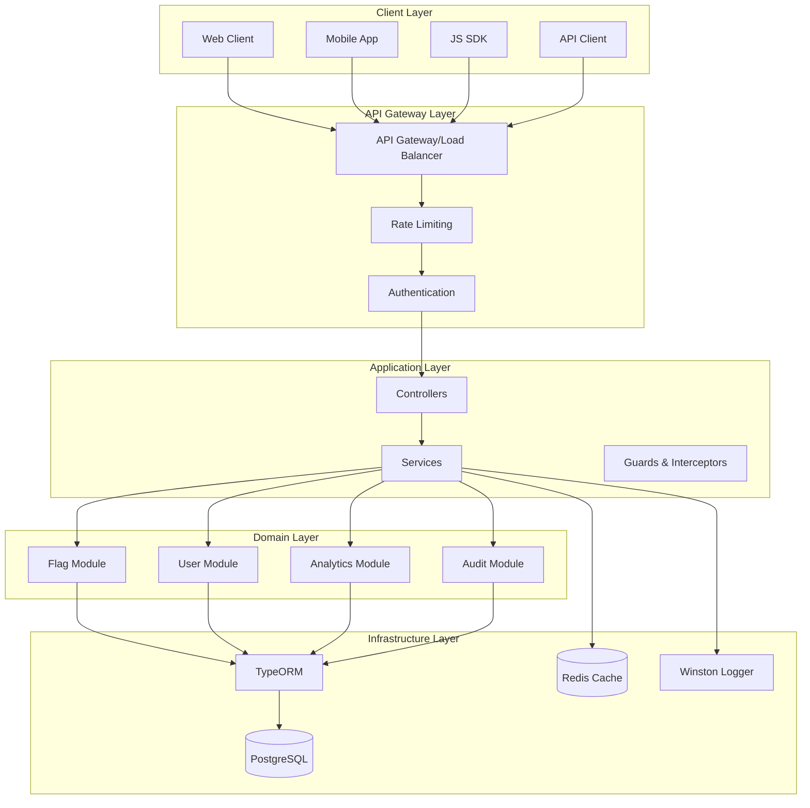
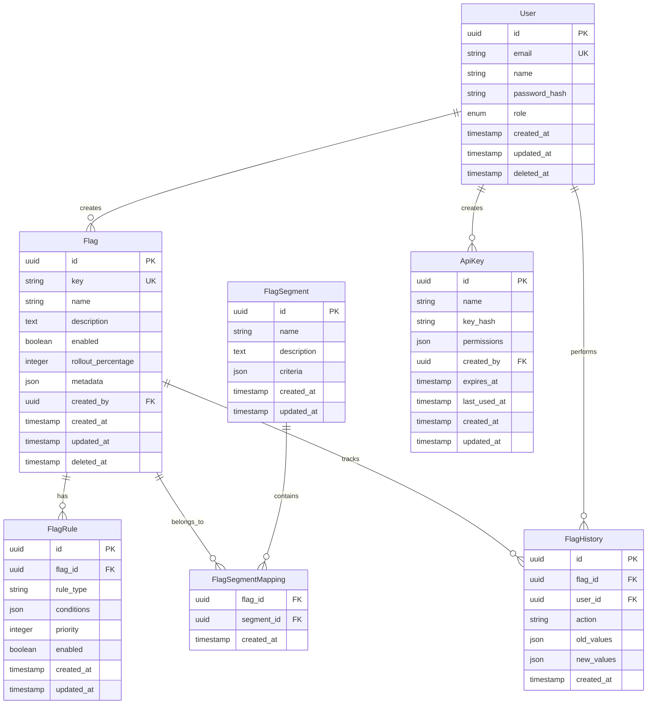
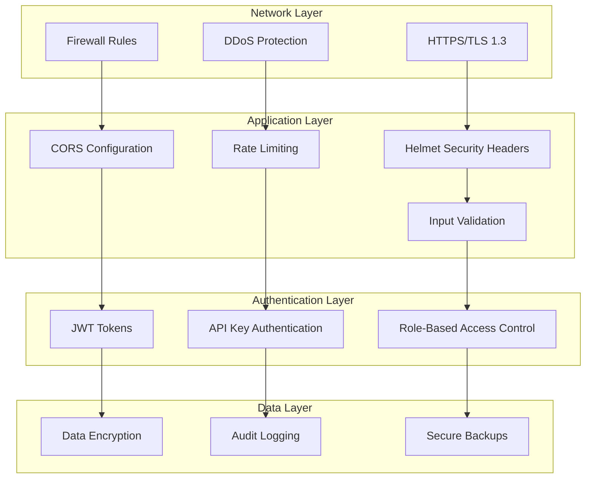
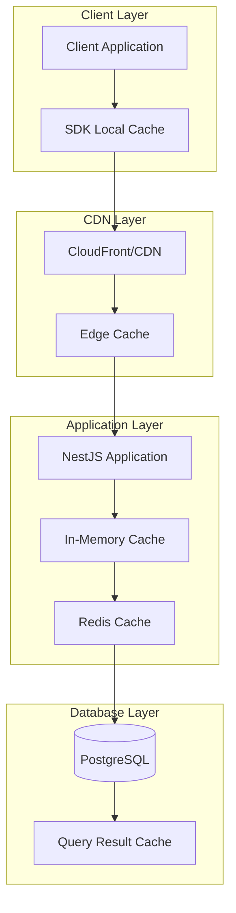
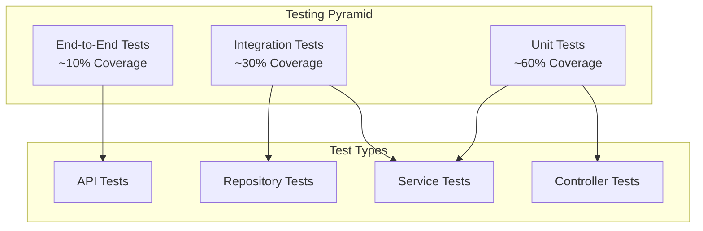
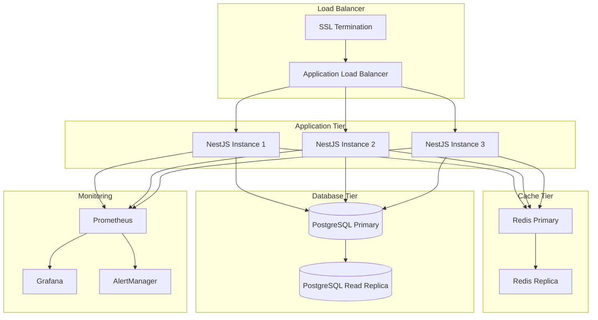

# Feature Flags API Server

A robust, production-ready backend service built with NestJS, TypeORM, and PostgreSQL, providing comprehensive REST APIs for feature flag management, user administration, and system analytics. This server implements enterprise-grade patterns for scalability, security, and maintainability.

## Table of Contents

- [Project Philosophy](#project-philosophy)
- [Architecture & Design Patterns](#architecture--design-patterns)
- [Project Structure](#project-structure)
- [Technology Stack](#technology-stack)
- [Development Practices](#development-practices)
- [Database Design](#database-design)
- [API Design](#api-design)
- [Security Implementation](#security-implementation)
- [Performance Optimizations](#performance-optimizations)
- [Testing Strategy](#testing-strategy)
- [Deployment & Operations](#deployment--operations)
- [Best Practices](#best-practices)

## Project Philosophy

### Design Principles

Our backend service is architected around enterprise software development principles that ensure long-term maintainability and scalability:

| Principle | Implementation | Benefit |
|-----------|----------------|---------|
| **Domain-Driven Design** | Feature-based modules with clear boundaries | Business logic clarity and maintainability |
| **SOLID Principles** | Dependency injection, interface segregation | Testable and extensible code |
| **API-First Development** | OpenAPI specification with automated documentation | Contract-driven development |
| **Security by Design** | Multiple security layers with defense in depth | Comprehensive protection against threats |
| **Observability** | Structured logging, health checks, metrics | Production monitoring and debugging |
| **Type Safety** | Comprehensive TypeScript with strict settings | Reduced runtime errors and better DX |

### Business Domain Understanding

The feature flag system addresses several critical business needs:

- **Risk Management**: Enable safe deployments with instant rollback capabilities
- **Product Experimentation**: Support A/B testing and gradual feature rollouts  
- **Operational Control**: Provide runtime configuration without code deployments
- **Compliance**: Maintain audit trails and access controls for regulated environments
- **Performance**: Minimize latency impact on client applications through efficient APIs

## Architecture & Design Patterns

### System Architecture Overview



### Architectural Patterns

#### 1. Layered Architecture
We implement a clean layered architecture with clear separation of concerns:

| Layer | Responsibility | Components |
|-------|----------------|------------|
| **Presentation** | HTTP handling, validation, serialization | Controllers, DTOs, Pipes |
| **Application** | Business workflows, orchestration | Services, Use Cases |
| **Domain** | Business logic, entities, rules | Entities, Domain Services |
| **Infrastructure** | Data persistence, external services | Repositories, External APIs |

#### 2. Module-Based Organization
NestJS modules provide natural boundaries for feature organization:

```typescript
@Module({
  imports: [
    TypeOrmModule.forFeature([Flag, FlagHistory]),
    CacheModule,
    LoggerModule
  ],
  controllers: [FlagController],
  providers: [
    FlagService,
    FlagRepository,
    FlagValidationService,
    FlagAuditService
  ],
  exports: [FlagService]
})
export class FlagModule {}
```

#### 3. Dependency Injection Pattern
Comprehensive DI for testability and flexibility:

```typescript
@Injectable()
export class FlagService {
  constructor(
    @InjectRepository(Flag)
    private readonly flagRepository: Repository<Flag>,
    private readonly cacheService: CacheService,
    private readonly auditService: AuditService,
    private readonly logger: Logger
  ) {}
}
```

### Design Patterns Implementation

#### 1. Repository Pattern
Abstraction layer for data access:

```typescript
@Injectable()
export class FlagRepository {
  constructor(
    @InjectRepository(Flag)
    private readonly repository: Repository<Flag>
  ) {}
  
  async findByKey(key: string): Promise<Flag | null> {
    return this.repository.findOne({ 
      where: { key },
      relations: ['rules', 'segments']
    });
  }
  
  async findActiveFlags(): Promise<Flag[]> {
    return this.repository.find({
      where: { enabled: true, deletedAt: IsNull() },
      order: { createdAt: 'DESC' }
    });
  }
}
```

#### 2. Strategy Pattern
For different flag evaluation strategies:

```typescript
interface FlagEvaluationStrategy {
  evaluate(flag: Flag, context: EvaluationContext): boolean;
}

@Injectable()
export class PercentageRolloutStrategy implements FlagEvaluationStrategy {
  evaluate(flag: Flag, context: EvaluationContext): boolean {
    const userHash = this.hashUser(context.userId);
    return (userHash % 100) < flag.rolloutPercentage;
  }
}

@Injectable()
export class UserSegmentStrategy implements FlagEvaluationStrategy {
  evaluate(flag: Flag, context: EvaluationContext): boolean {
    return flag.segments.some(segment => 
      this.isUserInSegment(context.user, segment)
    );
  }
}
```

#### 3. Observer Pattern
For audit logging and event handling:

```typescript
@Injectable()
export class FlagEventEmitter {
  private readonly eventEmitter = new EventEmitter2();
  
  emitFlagCreated(flag: Flag, user: User): void {
    this.eventEmitter.emit('flag.created', { flag, user, timestamp: new Date() });
  }
  
  emitFlagUpdated(flag: Flag, changes: Partial<Flag>, user: User): void {
    this.eventEmitter.emit('flag.updated', { flag, changes, user, timestamp: new Date() });
  }
}

@Injectable()
export class AuditListener {
  @OnEvent('flag.*')
  handleFlagEvent(event: FlagEvent): void {
    this.auditService.logEvent(event);
  }
}
```

## Project Structure

```
app-server/
├── src/
│   ├── config/                 # Configuration management
│   │   ├── database.config.ts  # Database configuration
│   │   ├── app.config.ts       # Application configuration
│   │   └── validation.schema.ts # Environment validation
│   ├── common/                 # Shared utilities and decorators
│   │   ├── decorators/         # Custom decorators
│   │   ├── filters/            # Exception filters
│   │   ├── guards/             # Authentication/authorization guards
│   │   ├── interceptors/       # Request/response interceptors
│   │   ├── pipes/              # Validation pipes
│   │   └── utils/              # Utility functions
│   ├── modules/                # Feature modules
│   │   ├── flags/              # Flag management module
│   │   │   ├── controllers/    # HTTP controllers
│   │   │   ├── services/       # Business logic services
│   │   │   ├── entities/       # Database entities
│   │   │   ├── dto/            # Data transfer objects
│   │   │   ├── repositories/   # Data access layer
│   │   │   └── strategies/     # Evaluation strategies
│   │   ├── users/              # User management module
│   │   ├── analytics/          # Analytics and reporting
│   │   ├── audit/              # Audit logging
│   │   └── health/             # Health check endpoints
│   ├── database/               # Database related files
│   │   ├── migrations/         # Database migrations
│   │   ├── seeds/              # Database seeders
│   │   └── factories/          # Test data factories
│   ├── main.ts                 # Application entry point
│   └── app.module.ts           # Root application module
├── test/                       # End-to-end tests
│   ├── fixtures/               # Test data fixtures
│   ├── helpers/                # Test helper functions
│   └── specs/                  # E2E test specifications
├── migrations/                 # TypeORM migrations
├── dist/                       # Compiled JavaScript output
├── .env                        # Environment variables
├── .env.example                # Environment template
├── nest-cli.json               # NestJS CLI configuration
├── tsconfig.json               # TypeScript configuration
├── tsconfig.build.json         # Build-specific TypeScript config
└── package.json                # Dependencies and scripts
```

### Module Organization Principles

#### 1. Feature-Based Modules
Each business domain has its own module with complete encapsulation:

```
modules/flags/
├── controllers/
│   └── flag.controller.ts      # HTTP endpoint handlers
├── services/
│   ├── flag.service.ts         # Core business logic
│   ├── flag-evaluation.service.ts # Flag evaluation logic
│   └── flag-validation.service.ts # Validation rules
├── entities/
│   ├── flag.entity.ts          # Flag database entity
│   ├── flag-rule.entity.ts     # Flag rules entity
│   └── flag-history.entity.ts  # Audit history entity
├── dto/
│   ├── create-flag.dto.ts      # Request DTOs
│   ├── update-flag.dto.ts
│   └── flag-response.dto.ts    # Response DTOs
├── repositories/
│   └── flag.repository.ts      # Data access abstraction
└── flag.module.ts              # Module definition
```

#### 2. Shared Common Module
Reusable components across all modules:

```
common/
├── decorators/
│   ├── api-response.decorator.ts    # Swagger response decorator
│   ├── current-user.decorator.ts    # User extraction decorator
│   └── validate-uuid.decorator.ts   # UUID validation decorator
├── filters/
│   ├── http-exception.filter.ts     # Global exception handling
│   └── validation-exception.filter.ts # Validation error handling
├── guards/
│   ├── jwt-auth.guard.ts            # JWT authentication
│   ├── roles.guard.ts               # Role-based authorization
│   └── rate-limit.guard.ts          # Rate limiting
├── interceptors/
│   ├── logging.interceptor.ts       # Request/response logging
│   ├── transform.interceptor.ts     # Response transformation
│   └── cache.interceptor.ts         # Response caching
└── pipes/
    ├── validation.pipe.ts           # Input validation
    └── parse-uuid.pipe.ts           # UUID parsing
```

## Technology Stack

### Core Technologies

| Technology | Version | Purpose | Selection Rationale |
|------------|---------|---------|-------------------|
| **NestJS** | 11.x | Application Framework | Enterprise architecture, TypeScript-first, extensive ecosystem |
| **TypeScript** | 5.7.x | Programming Language | Type safety, enhanced IDE support, reduced runtime errors |
| **TypeORM** | 0.3.x | Object-Relational Mapping | Type-safe database operations, migration support, Active Record pattern |
| **PostgreSQL** | 14+ | Primary Database | ACID compliance, JSON support, proven scalability, rich feature set |
| **Redis** | 7+ | Caching Layer | High-performance caching, session storage, pub/sub capabilities |

### Supporting Libraries

| Library | Purpose | Integration Benefits |
|---------|---------|---------------------|
| **class-validator** | Input Validation | Decorator-based validation, TypeScript integration |
| **class-transformer** | Data Transformation | Automatic serialization/deserialization |
| **Helmet** | Security Headers | HTTP security headers, XSS protection |
| **Winston** | Logging | Structured logging, multiple transports |
| **Joi** | Configuration Validation | Environment variable validation |
| **Swagger UI Express** | API Documentation | Interactive API documentation |
| **Jest** | Testing Framework | Unit and integration testing |
| **Supertest** | HTTP Testing | End-to-end API testing |

### Development Tools

| Tool | Configuration File | Purpose |
|------|-------------------|---------|
| **ESLint** | `eslint.config.mjs` | Code linting and style enforcement |
| **Prettier** | `.prettierrc` | Code formatting |
| **Husky** | `.husky/` | Git hooks for quality gates |
| **TypeScript** | `tsconfig.json` | Type checking and compilation |
| **NestJS CLI** | `nest-cli.json` | Code generation and build tools |

## Development Practices

### Code Quality Standards

#### 1. TypeScript Configuration
Strict TypeScript settings ensure maximum type safety:

```json
{
  "compilerOptions": {
    "strict": true,
    "noImplicitAny": true,
    "strictNullChecks": true,
    "strictFunctionTypes": true,
    "noImplicitReturns": true,
    "noFallthroughCasesInSwitch": true,
    "noUncheckedIndexedAccess": true,
    "exactOptionalPropertyTypes": true
  }
}
```

#### 2. ESLint Configuration
Comprehensive linting rules for consistency:

```javascript
module.exports = {
  extends: [
    '@nestjs/eslint-config',
    '@typescript-eslint/recommended',
    'prettier'
  ],
  rules: {
    '@typescript-eslint/no-unused-vars': 'error',
    '@typescript-eslint/explicit-function-return-type': 'warn',
    '@typescript-eslint/no-explicit-any': 'error',
    'prefer-const': 'error',
    'no-var': 'error'
  }
};
```

#### 3. Code Organization Standards

**Import Organization:**
```typescript
// 1. Node.js built-in modules
import { readFileSync } from 'fs';
import { join } from 'path';

// 2. Third-party libraries
import { Injectable, Logger } from '@nestjs/common';
import { InjectRepository } from '@nestjs/typeorm';
import { Repository } from 'typeorm';

// 3. Internal modules (absolute imports)
import { Flag } from '@/modules/flags/entities/flag.entity';
import { CacheService } from '@/common/services/cache.service';

// 4. Relative imports
import { CreateFlagDto } from './dto/create-flag.dto';
```

**Naming Conventions:**
| Type | Convention | Example |
|------|------------|---------|
| **Classes** | PascalCase | `FlagService`, `UserController` |
| **Interfaces** | PascalCase with 'I' prefix | `IFlagRepository`, `IUserService` |
| **Methods** | camelCase | `createFlag()`, `validateUser()` |
| **Constants** | UPPER_SNAKE_CASE | `DEFAULT_CACHE_TTL`, `MAX_RETRY_ATTEMPTS` |
| **Files** | kebab-case | `flag.service.ts`, `user.controller.ts` |

### Service Layer Patterns

#### 1. Service Structure Template

```typescript
@Injectable()
export class FlagService {
  private readonly logger = new Logger(FlagService.name);
  
  constructor(
    @InjectRepository(Flag)
    private readonly flagRepository: Repository<Flag>,
    private readonly cacheService: CacheService,
    private readonly auditService: AuditService,
    private readonly eventEmitter: EventEmitter2
  ) {}
  
  /**
   * Creates a new feature flag
   * @param createFlagDto - Flag creation data
   * @param user - User creating the flag
   * @returns Created flag entity
   */
  async createFlag(createFlagDto: CreateFlagDto, user: User): Promise<Flag> {
    this.logger.log(`Creating flag: ${createFlagDto.key}`);
    
    // Validation
    await this.validateFlagKey(createFlagDto.key);
    
    // Business logic
    const flag = this.flagRepository.create({
      ...createFlagDto,
      createdBy: user.id,
      createdAt: new Date()
    });
    
    // Persistence
    const savedFlag = await this.flagRepository.save(flag);
    
    // Side effects
    await this.cacheService.invalidate(`flag:${flag.key}`);
    this.eventEmitter.emit('flag.created', { flag: savedFlag, user });
    
    this.logger.log(`Flag created successfully: ${savedFlag.id}`);
    return savedFlag;
  }
  
  private async validateFlagKey(key: string): Promise<void> {
    const existingFlag = await this.flagRepository.findOne({ where: { key } });
    if (existingFlag) {
      throw new ConflictException(`Flag with key '${key}' already exists`);
    }
  }
}
```

#### 2. Error Handling Patterns

```typescript
@Injectable()
export class FlagService {
  async getFlagByKey(key: string): Promise<Flag> {
    try {
      // Try cache first
      const cached = await this.cacheService.get<Flag>(`flag:${key}`);
      if (cached) {
        return cached;
      }
      
      // Fallback to database
      const flag = await this.flagRepository.findOne({ 
        where: { key },
        relations: ['rules', 'segments']
      });
      
      if (!flag) {
        throw new NotFoundException(`Flag with key '${key}' not found`);
      }
      
      // Cache for future requests
      await this.cacheService.set(`flag:${key}`, flag, 300); // 5 minutes TTL
      
      return flag;
    } catch (error) {
      this.logger.error(`Error retrieving flag ${key}:`, error.stack);
      
      if (error instanceof NotFoundException) {
        throw error;
      }
      
      throw new InternalServerErrorException('Failed to retrieve flag');
    }
  }
}
```

### Controller Layer Patterns

#### 1. Controller Structure Template

```typescript
@Controller('flags')
@ApiTags('Feature Flags')
@UseGuards(JwtAuthGuard)
export class FlagController {
  constructor(private readonly flagService: FlagService) {}
  
  @Post()
  @ApiOperation({ summary: 'Create a new feature flag' })
  @ApiResponse({ status: 201, description: 'Flag created successfully', type: FlagResponseDto })
  @ApiResponse({ status: 400, description: 'Invalid input data' })
  @ApiResponse({ status: 409, description: 'Flag key already exists' })
  @UsePipes(new ValidationPipe({ transform: true }))
  async createFlag(
    @Body() createFlagDto: CreateFlagDto,
    @CurrentUser() user: User
  ): Promise<FlagResponseDto> {
    const flag = await this.flagService.createFlag(createFlagDto, user);
    return new FlagResponseDto(flag);
  }
  
  @Get(':key')
  @ApiOperation({ summary: 'Get flag by key' })
  @ApiParam({ name: 'key', description: 'Flag key identifier' })
  @ApiResponse({ status: 200, description: 'Flag retrieved successfully', type: FlagResponseDto })
  @ApiResponse({ status: 404, description: 'Flag not found' })
  async getFlagByKey(
    @Param('key') key: string
  ): Promise<FlagResponseDto> {
    const flag = await this.flagService.getFlagByKey(key);
    return new FlagResponseDto(flag);
  }
  
  @Put(':id')
  @ApiOperation({ summary: 'Update an existing flag' })
  @UseGuards(RolesGuard)
  @Roles(UserRole.ADMIN, UserRole.EDITOR)
  async updateFlag(
    @Param('id', ParseUUIDPipe) id: string,
    @Body() updateFlagDto: UpdateFlagDto,
    @CurrentUser() user: User
  ): Promise<FlagResponseDto> {
    const flag = await this.flagService.updateFlag(id, updateFlagDto, user);
    return new FlagResponseDto(flag);
  }
}
```

#### 2. DTO Design Patterns

```typescript
// Input DTO with validation
export class CreateFlagDto {
  @ApiProperty({ description: 'Unique flag identifier' })
  @IsString()
  @Length(3, 50)
  @Matches(/^[a-z0-9-_]+$/, { message: 'Key must contain only lowercase letters, numbers, hyphens, and underscores' })
  key: string;
  
  @ApiProperty({ description: 'Human-readable flag name' })
  @IsString()
  @Length(1, 100)
  name: string;
  
  @ApiProperty({ description: 'Flag description', required: false })
  @IsOptional()
  @IsString()
  @MaxLength(500)
  description?: string;
  
  @ApiProperty({ description: 'Flag enabled state', default: false })
  @IsBoolean()
  @IsOptional()
  enabled?: boolean = false;
  
  @ApiProperty({ description: 'Rollout percentage (0-100)', minimum: 0, maximum: 100 })
  @IsNumber()
  @Min(0)
  @Max(100)
  @IsOptional()
  rolloutPercentage?: number = 0;
}

// Response DTO with transformation
export class FlagResponseDto {
  @ApiProperty()
  id: string;
  
  @ApiProperty()
  key: string;
  
  @ApiProperty()
  name: string;
  
  @ApiProperty()
  description: string;
  
  @ApiProperty()
  enabled: boolean;
  
  @ApiProperty()
  rolloutPercentage: number;
  
  @ApiProperty()
  @Transform(({ value }) => value.toISOString())
  createdAt: Date;
  
  @ApiProperty()
  @Transform(({ value }) => value.toISOString())
  updatedAt: Date;
  
  constructor(flag: Flag) {
    this.id = flag.id;
    this.key = flag.key;
    this.name = flag.name;
    this.description = flag.description;
    this.enabled = flag.enabled;
    this.rolloutPercentage = flag.rolloutPercentage;
    this.createdAt = flag.createdAt;
    this.updatedAt = flag.updatedAt;
  }
}
```##
 Database Design

### Entity Relationship Model



### Entity Design Patterns

#### 1. Base Entity Pattern
Common fields and functionality across all entities:

```typescript
@Entity()
export abstract class BaseEntity {
  @PrimaryGeneratedColumn('uuid')
  id: string;
  
  @CreateDateColumn({ type: 'timestamp with time zone' })
  createdAt: Date;
  
  @UpdateDateColumn({ type: 'timestamp with time zone' })
  updatedAt: Date;
  
  @DeleteDateColumn({ type: 'timestamp with time zone', nullable: true })
  deletedAt?: Date;
  
  @VersionColumn()
  version: number;
}
```

#### 2. Flag Entity Implementation

```typescript
@Entity('flags')
@Index(['key'], { unique: true, where: 'deleted_at IS NULL' })
@Index(['enabled', 'deletedAt'])
export class Flag extends BaseEntity {
  @Column({ type: 'varchar', length: 50, unique: true })
  key: string;
  
  @Column({ type: 'varchar', length: 100 })
  name: string;
  
  @Column({ type: 'text', nullable: true })
  description?: string;
  
  @Column({ type: 'boolean', default: false })
  enabled: boolean;
  
  @Column({ type: 'integer', default: 0, name: 'rollout_percentage' })
  @Min(0)
  @Max(100)
  rolloutPercentage: number;
  
  @Column({ type: 'jsonb', nullable: true })
  metadata?: Record<string, any>;
  
  @Column({ type: 'uuid', name: 'created_by' })
  createdBy: string;
  
  // Relationships
  @ManyToOne(() => User, { eager: false })
  @JoinColumn({ name: 'created_by' })
  creator: User;
  
  @OneToMany(() => FlagRule, rule => rule.flag, { cascade: true })
  rules: FlagRule[];
  
  @ManyToMany(() => FlagSegment, segment => segment.flags)
  @JoinTable({
    name: 'flag_segment_mappings',
    joinColumn: { name: 'flag_id', referencedColumnName: 'id' },
    inverseJoinColumn: { name: 'segment_id', referencedColumnName: 'id' }
  })
  segments: FlagSegment[];
  
  @OneToMany(() => FlagHistory, history => history.flag)
  history: FlagHistory[];
  
  // Computed properties
  @Expose()
  get isActive(): boolean {
    return this.enabled && !this.deletedAt;
  }
  
  @Expose()
  get effectiveRollout(): number {
    return this.enabled ? this.rolloutPercentage : 0;
  }
}
```

#### 3. Advanced Entity Features

```typescript
@Entity('flag_rules')
export class FlagRule extends BaseEntity {
  @Column({ type: 'uuid', name: 'flag_id' })
  flagId: string;
  
  @Column({ type: 'varchar', length: 50, name: 'rule_type' })
  ruleType: FlagRuleType;
  
  @Column({ type: 'jsonb' })
  @ValidateNested()
  @Type(() => RuleCondition)
  conditions: RuleCondition[];
  
  @Column({ type: 'integer', default: 0 })
  priority: number;
  
  @Column({ type: 'boolean', default: true })
  enabled: boolean;
  
  @ManyToOne(() => Flag, flag => flag.rules, { onDelete: 'CASCADE' })
  @JoinColumn({ name: 'flag_id' })
  flag: Flag;
  
  // Business logic methods
  evaluate(context: EvaluationContext): boolean {
    if (!this.enabled) return false;
    
    return this.conditions.every(condition => 
      this.evaluateCondition(condition, context)
    );
  }
  
  private evaluateCondition(condition: RuleCondition, context: EvaluationContext): boolean {
    switch (condition.operator) {
      case 'equals':
        return context.getValue(condition.field) === condition.value;
      case 'in':
        return condition.values.includes(context.getValue(condition.field));
      case 'greater_than':
        return context.getValue(condition.field) > condition.value;
      // Additional operators...
      default:
        return false;
    }
  }
}
```

### Migration Strategy

#### 1. Migration Structure

```typescript
// migrations/1699123456789-CreateFlagsTable.ts
import { MigrationInterface, QueryRunner, Table, Index } from 'typeorm';

export class CreateFlagsTable1699123456789 implements MigrationInterface {
  name = 'CreateFlagsTable1699123456789';
  
  public async up(queryRunner: QueryRunner): Promise<void> {
    await queryRunner.createTable(
      new Table({
        name: 'flags',
        columns: [
          {
            name: 'id',
            type: 'uuid',
            isPrimary: true,
            generationStrategy: 'uuid',
            default: 'gen_random_uuid()'
          },
          {
            name: 'key',
            type: 'varchar',
            length: '50',
            isUnique: true
          },
          {
            name: 'name',
            type: 'varchar',
            length: '100'
          },
          {
            name: 'description',
            type: 'text',
            isNullable: true
          },
          {
            name: 'enabled',
            type: 'boolean',
            default: false
          },
          {
            name: 'rollout_percentage',
            type: 'integer',
            default: 0
          },
          {
            name: 'metadata',
            type: 'jsonb',
            isNullable: true
          },
          {
            name: 'created_by',
            type: 'uuid'
          },
          {
            name: 'created_at',
            type: 'timestamp with time zone',
            default: 'CURRENT_TIMESTAMP'
          },
          {
            name: 'updated_at',
            type: 'timestamp with time zone',
            default: 'CURRENT_TIMESTAMP'
          },
          {
            name: 'deleted_at',
            type: 'timestamp with time zone',
            isNullable: true
          },
          {
            name: 'version',
            type: 'integer',
            default: 1
          }
        ]
      }),
      true
    );
    
    // Create indexes
    await queryRunner.createIndex('flags', new Index({
      name: 'IDX_flags_key_not_deleted',
      columnNames: ['key'],
      where: 'deleted_at IS NULL',
      isUnique: true
    }));
    
    await queryRunner.createIndex('flags', new Index({
      name: 'IDX_flags_enabled_deleted',
      columnNames: ['enabled', 'deleted_at']
    }));
  }
  
  public async down(queryRunner: QueryRunner): Promise<void> {
    await queryRunner.dropTable('flags');
  }
}
```

#### 2. Data Migration Patterns

```typescript
// migrations/1699123456790-SeedDefaultFlags.ts
export class SeedDefaultFlags1699123456790 implements MigrationInterface {
  public async up(queryRunner: QueryRunner): Promise<void> {
    const defaultFlags = [
      {
        key: 'maintenance-mode',
        name: 'Maintenance Mode',
        description: 'Enable maintenance mode across the application',
        enabled: false,
        rollout_percentage: 0
      },
      {
        key: 'new-dashboard',
        name: 'New Dashboard UI',
        description: 'Enable the redesigned dashboard interface',
        enabled: false,
        rollout_percentage: 10
      }
    ];
    
    for (const flag of defaultFlags) {
      await queryRunner.query(
        `INSERT INTO flags (key, name, description, enabled, rollout_percentage, created_by) 
         VALUES ($1, $2, $3, $4, $5, $6)`,
        [flag.key, flag.name, flag.description, flag.enabled, flag.rollout_percentage, 'system']
      );
    }
  }
  
  public async down(queryRunner: QueryRunner): Promise<void> {
    await queryRunner.query(`DELETE FROM flags WHERE created_by = 'system'`);
  }
}
```

### Database Performance Optimization

#### 1. Indexing Strategy

| Table | Index | Purpose | Type |
|-------|-------|---------|------|
| **flags** | `key` (unique, partial) | Fast flag lookup by key | B-tree |
| **flags** | `enabled, deleted_at` | Active flags queries | Composite |
| **flag_rules** | `flag_id, priority` | Rule evaluation order | Composite |
| **flag_history** | `flag_id, created_at` | Audit trail queries | Composite |
| **users** | `email` (unique) | User authentication | B-tree |

#### 2. Query Optimization Patterns

```typescript
@Injectable()
export class FlagRepository {
  // Optimized query with proper joins and caching
  async findActiveFlagsWithRules(): Promise<Flag[]> {
    return this.repository
      .createQueryBuilder('flag')
      .leftJoinAndSelect('flag.rules', 'rule', 'rule.enabled = :ruleEnabled', { ruleEnabled: true })
      .leftJoinAndSelect('flag.segments', 'segment')
      .where('flag.enabled = :enabled', { enabled: true })
      .andWhere('flag.deletedAt IS NULL')
      .orderBy('flag.createdAt', 'DESC')
      .cache(60000) // Cache for 1 minute
      .getMany();
  }
  
  // Efficient pagination with cursor-based approach
  async findFlagsPaginated(cursor?: string, limit: number = 20): Promise<{
    flags: Flag[];
    nextCursor?: string;
    hasMore: boolean;
  }> {
    const queryBuilder = this.repository
      .createQueryBuilder('flag')
      .where('flag.deletedAt IS NULL')
      .orderBy('flag.createdAt', 'DESC')
      .limit(limit + 1);
    
    if (cursor) {
      queryBuilder.andWhere('flag.createdAt < :cursor', { cursor: new Date(cursor) });
    }
    
    const flags = await queryBuilder.getMany();
    const hasMore = flags.length > limit;
    
    if (hasMore) {
      flags.pop(); // Remove the extra record
    }
    
    const nextCursor = hasMore ? flags[flags.length - 1]?.createdAt.toISOString() : undefined;
    
    return { flags, nextCursor, hasMore };
  }
}
```

## API Design

### RESTful API Principles

Our API follows REST conventions with additional considerations for feature flag specific requirements:

#### 1. Resource Naming Conventions

| Resource | Endpoint | HTTP Method | Purpose |
|----------|----------|-------------|---------|
| **Flags Collection** | `GET /api/flags` | GET | List all flags |
| **Flag Resource** | `GET /api/flags/{key}` | GET | Get specific flag |
| **Flag Creation** | `POST /api/flags` | POST | Create new flag |
| **Flag Update** | `PUT /api/flags/{id}` | PUT | Update entire flag |
| **Flag Patch** | `PATCH /api/flags/{id}` | PATCH | Partial flag update |
| **Flag Deletion** | `DELETE /api/flags/{id}` | DELETE | Soft delete flag |
| **Flag Evaluation** | `GET /api/flags/{key}/evaluate` | GET | Evaluate flag for context |

#### 2. Response Format Standards

```typescript
// Success Response Format
interface ApiResponse<T> {
  success: true;
  data: T;
  meta?: {
    pagination?: PaginationMeta;
    timestamp: string;
    version: string;
  };
}

// Error Response Format
interface ApiErrorResponse {
  success: false;
  error: {
    code: string;
    message: string;
    details?: Record<string, any>;
    timestamp: string;
    path: string;
    requestId: string;
  };
}

// Pagination Metadata
interface PaginationMeta {
  page: number;
  limit: number;
  total: number;
  totalPages: number;
  hasNext: boolean;
  hasPrevious: boolean;
}
```

#### 3. API Versioning Strategy

```typescript
// Version-specific controllers
@Controller({ path: 'flags', version: '1' })
export class FlagV1Controller {
  // V1 implementation
}

@Controller({ path: 'flags', version: '2' })
export class FlagV2Controller {
  // V2 implementation with breaking changes
}

// Global versioning configuration
app.enableVersioning({
  type: VersioningType.URI,
  prefix: 'v',
  defaultVersion: '1'
});
```

### OpenAPI Documentation

#### 1. Comprehensive API Documentation

```typescript
@Controller('flags')
@ApiTags('Feature Flags')
@ApiBearerAuth()
export class FlagController {
  @Get()
  @ApiOperation({
    summary: 'List feature flags',
    description: 'Retrieve a paginated list of feature flags with optional filtering'
  })
  @ApiQuery({ name: 'page', required: false, type: Number, description: 'Page number (1-based)' })
  @ApiQuery({ name: 'limit', required: false, type: Number, description: 'Items per page (max 100)' })
  @ApiQuery({ name: 'enabled', required: false, type: Boolean, description: 'Filter by enabled status' })
  @ApiQuery({ name: 'search', required: false, type: String, description: 'Search in name and description' })
  @ApiResponse({
    status: 200,
    description: 'Flags retrieved successfully',
    schema: {
      type: 'object',
      properties: {
        success: { type: 'boolean', example: true },
        data: {
          type: 'array',
          items: { $ref: '#/components/schemas/FlagResponseDto' }
        },
        meta: {
          type: 'object',
          properties: {
            pagination: { $ref: '#/components/schemas/PaginationMeta' }
          }
        }
      }
    }
  })
  @ApiResponse({ status: 400, description: 'Invalid query parameters' })
  @ApiResponse({ status: 401, description: 'Unauthorized' })
  async getFlags(
    @Query() query: GetFlagsQueryDto
  ): Promise<ApiResponse<FlagResponseDto[]>> {
    // Implementation
  }
}
```

#### 2. Schema Definitions

```typescript
@ApiSchema({
  name: 'Flag',
  description: 'Feature flag entity with all properties'
})
export class FlagResponseDto {
  @ApiProperty({ description: 'Unique flag identifier', format: 'uuid' })
  id: string;
  
  @ApiProperty({ 
    description: 'Flag key for programmatic access',
    pattern: '^[a-z0-9-_]+$',
    minLength: 3,
    maxLength: 50
  })
  key: string;
  
  @ApiProperty({ description: 'Human-readable flag name' })
  name: string;
  
  @ApiProperty({ description: 'Flag description', nullable: true })
  description?: string;
  
  @ApiProperty({ description: 'Flag enabled status' })
  enabled: boolean;
  
  @ApiProperty({ 
    description: 'Rollout percentage (0-100)',
    minimum: 0,
    maximum: 100
  })
  rolloutPercentage: number;
  
  @ApiProperty({ description: 'Flag creation timestamp', format: 'date-time' })
  createdAt: string;
  
  @ApiProperty({ description: 'Last update timestamp', format: 'date-time' })
  updatedAt: string;
}
```

### API Security Implementation

#### 1. Authentication & Authorization

```typescript
@Injectable()
export class JwtAuthGuard extends AuthGuard('jwt') {
  canActivate(context: ExecutionContext): boolean | Promise<boolean> {
    return super.canActivate(context);
  }
  
  handleRequest(err: any, user: any, info: any) {
    if (err || !user) {
      throw err || new UnauthorizedException('Invalid token');
    }
    return user;
  }
}

@Injectable()
export class RolesGuard implements CanActivate {
  constructor(private reflector: Reflector) {}
  
  canActivate(context: ExecutionContext): boolean {
    const requiredRoles = this.reflector.getAllAndOverride<UserRole[]>(ROLES_KEY, [
      context.getHandler(),
      context.getClass(),
    ]);
    
    if (!requiredRoles) {
      return true;
    }
    
    const { user } = context.switchToHttp().getRequest();
    return requiredRoles.some((role) => user.roles?.includes(role));
  }
}
```

#### 2. Rate Limiting

```typescript
@Injectable()
export class CustomRateLimitGuard implements CanActivate {
  constructor(private readonly cacheService: CacheService) {}
  
  async canActivate(context: ExecutionContext): Promise<boolean> {
    const request = context.switchToHttp().getRequest();
    const key = this.generateKey(request);
    
    const current = await this.cacheService.get<number>(key) || 0;
    const limit = this.getLimit(request);
    const window = this.getWindow(request);
    
    if (current >= limit) {
      throw new ThrottlerException('Rate limit exceeded');
    }
    
    await this.cacheService.set(key, current + 1, window);
    return true;
  }
  
  private generateKey(request: Request): string {
    const userId = request.user?.id || request.ip;
    const endpoint = `${request.method}:${request.route?.path}`;
    return `rate_limit:${userId}:${endpoint}`;
  }
  
  private getLimit(request: Request): number {
    // Different limits based on endpoint and user type
    if (request.route?.path.includes('/evaluate')) {
      return request.user?.isPremium ? 10000 : 1000; // Per minute
    }
    return request.user?.isAdmin ? 1000 : 100;
  }
}
```

## Security Implementation

### Multi-Layer Security Architecture



### Security Implementation Details

#### 1. Input Validation & Sanitization

```typescript
@Injectable()
export class SecurityValidationPipe implements PipeTransform {
  transform(value: any, metadata: ArgumentMetadata) {
    if (metadata.type === 'body') {
      // Sanitize HTML content
      if (typeof value === 'object') {
        this.sanitizeObject(value);
      }
      
      // Validate against XSS patterns
      this.validateXSS(value);
      
      // Check for SQL injection patterns
      this.validateSQLInjection(value);
    }
    
    return value;
  }
  
  private sanitizeObject(obj: any): void {
    for (const key in obj) {
      if (typeof obj[key] === 'string') {
        obj[key] = this.sanitizeString(obj[key]);
      } else if (typeof obj[key] === 'object') {
        this.sanitizeObject(obj[key]);
      }
    }
  }
  
  private sanitizeString(input: string): string {
    return input
      .replace(/<script\b[^<]*(?:(?!<\/script>)<[^<]*)*<\/script>/gi, '')
      .replace(/javascript:/gi, '')
      .replace(/on\w+\s*=/gi, '');
  }
}
```

#### 2. Secure Configuration Management

```typescript
// config/security.config.ts
export const securityConfig = () => ({
  jwt: {
    secret: process.env.JWT_SECRET,
    expiresIn: process.env.JWT_EXPIRES_IN || '1h',
    refreshExpiresIn: process.env.JWT_REFRESH_EXPIRES_IN || '7d',
  },
  bcrypt: {
    saltRounds: parseInt(process.env.BCRYPT_SALT_ROUNDS) || 12,
  },
  rateLimit: {
    windowMs: parseInt(process.env.RATE_LIMIT_WINDOW_MS) || 60000,
    max: parseInt(process.env.RATE_LIMIT_MAX) || 100,
  },
  cors: {
    origin: process.env.CORS_ORIGIN?.split(',') || ['http://localhost:3000'],
    credentials: true,
  },
});

// Validation schema
export const securityConfigSchema = Joi.object({
  JWT_SECRET: Joi.string().min(32).required(),
  JWT_EXPIRES_IN: Joi.string().default('1h'),
  BCRYPT_SALT_ROUNDS: Joi.number().min(10).max(15).default(12),
  RATE_LIMIT_WINDOW_MS: Joi.number().default(60000),
  RATE_LIMIT_MAX: Joi.number().default(100),
  CORS_ORIGIN: Joi.string().required(),
});
```

#### 3. Audit Logging System

```typescript
@Injectable()
export class AuditService {
  constructor(
    @InjectRepository(AuditLog)
    private readonly auditRepository: Repository<AuditLog>,
    private readonly logger: Logger
  ) {}
  
  async logAction(action: AuditAction): Promise<void> {
    try {
      const auditLog = this.auditRepository.create({
        userId: action.userId,
        action: action.type,
        resource: action.resource,
        resourceId: action.resourceId,
        oldValues: action.oldValues,
        newValues: action.newValues,
        ipAddress: action.ipAddress,
        userAgent: action.userAgent,
        timestamp: new Date(),
      });
      
      await this.auditRepository.save(auditLog);
      
      // Also log to external audit system for compliance
      await this.logToExternalSystem(auditLog);
    } catch (error) {
      this.logger.error('Failed to log audit action:', error);
      // Don't throw - audit logging shouldn't break business logic
    }
  }
  
  private async logToExternalSystem(auditLog: AuditLog): Promise<void> {
    // Implementation for external audit system
    // Could be AWS CloudTrail, Splunk, etc.
  }
}

// Audit decorator for automatic logging
export function Audit(resource: string) {
  return function (target: any, propertyName: string, descriptor: PropertyDescriptor) {
    const method = descriptor.value;
    
    descriptor.value = async function (...args: any[]) {
      const request = this.getRequest();
      const user = request.user;
      
      const auditAction: AuditAction = {
        userId: user?.id,
        type: `${target.constructor.name}.${propertyName}`,
        resource,
        ipAddress: request.ip,
        userAgent: request.get('User-Agent'),
      };
      
      try {
        const result = await method.apply(this, args);
        auditAction.newValues = result;
        await this.auditService.logAction(auditAction);
        return result;
      } catch (error) {
        auditAction.error = error.message;
        await this.auditService.logAction(auditAction);
        throw error;
      }
    };
  };
}
```##
 Performance Optimizations

### Caching Strategy

#### 1. Multi-Level Caching Architecture



#### 2. Redis Caching Implementation

```typescript
@Injectable()
export class CacheService {
  constructor(
    @Inject(CACHE_MANAGER) private cacheManager: Cache,
    private readonly logger: Logger
  ) {}
  
  async get<T>(key: string): Promise<T | null> {
    try {
      const cached = await this.cacheManager.get<T>(key);
      if (cached) {
        this.logger.debug(`Cache hit for key: ${key}`);
        return cached;
      }
      this.logger.debug(`Cache miss for key: ${key}`);
      return null;
    } catch (error) {
      this.logger.error(`Cache get error for key ${key}:`, error);
      return null; // Graceful degradation
    }
  }
  
  async set<T>(key: string, value: T, ttl?: number): Promise<void> {
    try {
      await this.cacheManager.set(key, value, ttl);
      this.logger.debug(`Cache set for key: ${key}, TTL: ${ttl}`);
    } catch (error) {
      this.logger.error(`Cache set error for key ${key}:`, error);
      // Don't throw - caching failures shouldn't break business logic
    }
  }
  
  async invalidate(pattern: string): Promise<void> {
    try {
      const keys = await this.getKeysByPattern(pattern);
      await Promise.all(keys.map(key => this.cacheManager.del(key)));
      this.logger.debug(`Invalidated ${keys.length} keys matching pattern: ${pattern}`);
    } catch (error) {
      this.logger.error(`Cache invalidation error for pattern ${pattern}:`, error);
    }
  }
  
  private async getKeysByPattern(pattern: string): Promise<string[]> {
    // Implementation depends on cache store (Redis, Memory, etc.)
    // For Redis: use SCAN command
    // For Memory: iterate through keys
    return [];
  }
}
```

#### 3. Smart Caching Strategies

```typescript
@Injectable()
export class FlagCacheService {
  private readonly FLAG_CACHE_TTL = 300; // 5 minutes
  private readonly EVALUATION_CACHE_TTL = 60; // 1 minute
  
  constructor(private readonly cacheService: CacheService) {}
  
  async getFlagWithCache(key: string): Promise<Flag | null> {
    const cacheKey = `flag:${key}`;
    
    // Try cache first
    let flag = await this.cacheService.get<Flag>(cacheKey);
    
    if (!flag) {
      // Cache miss - fetch from database
      flag = await this.flagRepository.findByKey(key);
      
      if (flag) {
        // Cache the result
        await this.cacheService.set(cacheKey, flag, this.FLAG_CACHE_TTL);
      }
    }
    
    return flag;
  }
  
  async cacheEvaluationResult(
    flagKey: string, 
    context: EvaluationContext, 
    result: boolean
  ): Promise<void> {
    const contextHash = this.hashContext(context);
    const cacheKey = `evaluation:${flagKey}:${contextHash}`;
    
    await this.cacheService.set(cacheKey, result, this.EVALUATION_CACHE_TTL);
  }
  
  async invalidateFlagCache(flagKey: string): Promise<void> {
    await Promise.all([
      this.cacheService.invalidate(`flag:${flagKey}`),
      this.cacheService.invalidate(`evaluation:${flagKey}:*`)
    ]);
  }
  
  private hashContext(context: EvaluationContext): string {
    const normalized = {
      userId: context.userId,
      userSegments: context.userSegments?.sort(),
      customAttributes: Object.keys(context.customAttributes || {})
        .sort()
        .reduce((acc, key) => {
          acc[key] = context.customAttributes[key];
          return acc;
        }, {})
    };
    
    return createHash('md5').update(JSON.stringify(normalized)).digest('hex');
  }
}
```

### Database Performance

#### 1. Connection Pool Optimization

```typescript
// config/database.config.ts
export const databaseConfig = (): TypeOrmModuleOptions => ({
  type: 'postgres',
  host: process.env.DB_HOST,
  port: parseInt(process.env.DB_PORT) || 5432,
  username: process.env.DB_USERNAME,
  password: process.env.DB_PASSWORD,
  database: process.env.DB_NAME,
  
  // Connection pool settings
  extra: {
    max: parseInt(process.env.DB_POOL_MAX) || 20,
    min: parseInt(process.env.DB_POOL_MIN) || 5,
    acquire: parseInt(process.env.DB_POOL_ACQUIRE) || 60000,
    idle: parseInt(process.env.DB_POOL_IDLE) || 10000,
    evict: parseInt(process.env.DB_POOL_EVICT) || 1000,
    
    // Connection validation
    testOnBorrow: true,
    validationQuery: 'SELECT 1',
    
    // SSL configuration for production
    ssl: process.env.NODE_ENV === 'production' ? {
      rejectUnauthorized: false
    } : false,
  },
  
  // Query optimization
  cache: {
    duration: 30000, // 30 seconds
    type: 'redis',
    options: {
      host: process.env.REDIS_HOST,
      port: parseInt(process.env.REDIS_PORT) || 6379,
    }
  },
  
  // Logging for development
  logging: process.env.NODE_ENV === 'development' ? ['query', 'error'] : ['error'],
  maxQueryExecutionTime: 1000, // Log slow queries
});
```

#### 2. Query Optimization Patterns

```typescript
@Injectable()
export class OptimizedFlagRepository {
  constructor(
    @InjectRepository(Flag)
    private readonly repository: Repository<Flag>
  ) {}
  
  // Efficient bulk operations
  async findFlagsByKeys(keys: string[]): Promise<Map<string, Flag>> {
    if (keys.length === 0) return new Map();
    
    const flags = await this.repository
      .createQueryBuilder('flag')
      .where('flag.key IN (:...keys)', { keys })
      .andWhere('flag.deletedAt IS NULL')
      .getMany();
    
    return new Map(flags.map(flag => [flag.key, flag]));
  }
  
  // Optimized evaluation query
  async findEvaluationData(keys: string[]): Promise<FlagEvaluationData[]> {
    return this.repository
      .createQueryBuilder('flag')
      .select([
        'flag.key',
        'flag.enabled',
        'flag.rolloutPercentage',
        'rule.id',
        'rule.ruleType',
        'rule.conditions',
        'rule.priority',
        'segment.id',
        'segment.criteria'
      ])
      .leftJoin('flag.rules', 'rule', 'rule.enabled = true')
      .leftJoin('flag.segments', 'segment')
      .where('flag.key IN (:...keys)', { keys })
      .andWhere('flag.enabled = true')
      .andWhere('flag.deletedAt IS NULL')
      .orderBy('rule.priority', 'ASC')
      .getMany();
  }
  
  // Batch update for performance
  async updateFlagsEnabled(flagIds: string[], enabled: boolean): Promise<void> {
    await this.repository
      .createQueryBuilder()
      .update(Flag)
      .set({ 
        enabled,
        updatedAt: () => 'CURRENT_TIMESTAMP'
      })
      .where('id IN (:...flagIds)', { flagIds })
      .execute();
  }
}
```

### API Performance

#### 1. Response Compression & Optimization

```typescript
// main.ts - Application setup
async function bootstrap() {
  const app = await NestFactory.create(AppModule);
  
  // Enable compression
  app.use(compression({
    filter: (req, res) => {
      if (req.headers['x-no-compression']) {
        return false;
      }
      return compression.filter(req, res);
    },
    threshold: 1024, // Only compress responses > 1KB
  }));
  
  // Response time tracking
  app.use((req, res, next) => {
    const start = Date.now();
    res.on('finish', () => {
      const duration = Date.now() - start;
      console.log(`${req.method} ${req.url} - ${res.statusCode} - ${duration}ms`);
    });
    next();
  });
  
  await app.listen(3000);
}
```

#### 2. Efficient Serialization

```typescript
@Injectable()
export class ResponseTransformInterceptor implements NestInterceptor {
  intercept(context: ExecutionContext, next: CallHandler): Observable<any> {
    return next.handle().pipe(
      map(data => {
        // Remove sensitive fields
        if (data && typeof data === 'object') {
          return this.sanitizeResponse(data);
        }
        return data;
      }),
      // Add response metadata
      map(data => ({
        success: true,
        data,
        meta: {
          timestamp: new Date().toISOString(),
          version: process.env.API_VERSION || '1.0.0'
        }
      }))
    );
  }
  
  private sanitizeResponse(obj: any): any {
    if (Array.isArray(obj)) {
      return obj.map(item => this.sanitizeResponse(item));
    }
    
    if (obj && typeof obj === 'object') {
      const sanitized = { ...obj };
      
      // Remove sensitive fields
      delete sanitized.password;
      delete sanitized.passwordHash;
      delete sanitized.apiKey;
      delete sanitized.secret;
      
      // Recursively sanitize nested objects
      Object.keys(sanitized).forEach(key => {
        if (sanitized[key] && typeof sanitized[key] === 'object') {
          sanitized[key] = this.sanitizeResponse(sanitized[key]);
        }
      });
      
      return sanitized;
    }
    
    return obj;
  }
}
```

## Testing Strategy

### Testing Pyramid Implementation



### Unit Testing Patterns

#### 1. Service Layer Testing

```typescript
// flag.service.spec.ts
describe('FlagService', () => {
  let service: FlagService;
  let repository: Repository<Flag>;
  let cacheService: CacheService;
  let auditService: AuditService;
  
  beforeEach(async () => {
    const module: TestingModule = await Test.createTestingModule({
      providers: [
        FlagService,
        {
          provide: getRepositoryToken(Flag),
          useValue: {
            findOne: jest.fn(),
            save: jest.fn(),
            create: jest.fn(),
            update: jest.fn(),
            delete: jest.fn(),
          },
        },
        {
          provide: CacheService,
          useValue: {
            get: jest.fn(),
            set: jest.fn(),
            invalidate: jest.fn(),
          },
        },
        {
          provide: AuditService,
          useValue: {
            logAction: jest.fn(),
          },
        },
      ],
    }).compile();
    
    service = module.get<FlagService>(FlagService);
    repository = module.get<Repository<Flag>>(getRepositoryToken(Flag));
    cacheService = module.get<CacheService>(CacheService);
    auditService = module.get<AuditService>(AuditService);
  });
  
  describe('createFlag', () => {
    it('should create a flag successfully', async () => {
      // Arrange
      const createFlagDto: CreateFlagDto = {
        key: 'test-flag',
        name: 'Test Flag',
        description: 'Test description',
        enabled: false,
        rolloutPercentage: 0,
      };
      
      const user = { id: 'user-1', email: 'test@example.com' } as User;
      const savedFlag = { id: 'flag-1', ...createFlagDto } as Flag;
      
      jest.spyOn(repository, 'findOne').mockResolvedValue(null);
      jest.spyOn(repository, 'create').mockReturnValue(savedFlag);
      jest.spyOn(repository, 'save').mockResolvedValue(savedFlag);
      jest.spyOn(cacheService, 'invalidate').mockResolvedValue();
      jest.spyOn(auditService, 'logAction').mockResolvedValue();
      
      // Act
      const result = await service.createFlag(createFlagDto, user);
      
      // Assert
      expect(result).toEqual(savedFlag);
      expect(repository.findOne).toHaveBeenCalledWith({ where: { key: 'test-flag' } });
      expect(repository.save).toHaveBeenCalledWith(savedFlag);
      expect(cacheService.invalidate).toHaveBeenCalledWith('flag:test-flag');
      expect(auditService.logAction).toHaveBeenCalledWith(
        expect.objectContaining({
          type: 'flag.created',
          resource: 'flag',
          resourceId: 'flag-1',
        })
      );
    });
    
    it('should throw ConflictException when flag key already exists', async () => {
      // Arrange
      const createFlagDto: CreateFlagDto = {
        key: 'existing-flag',
        name: 'Existing Flag',
        enabled: false,
        rolloutPercentage: 0,
      };
      
      const user = { id: 'user-1' } as User;
      const existingFlag = { id: 'flag-1', key: 'existing-flag' } as Flag;
      
      jest.spyOn(repository, 'findOne').mockResolvedValue(existingFlag);
      
      // Act & Assert
      await expect(service.createFlag(createFlagDto, user))
        .rejects
        .toThrow(ConflictException);
      
      expect(repository.save).not.toHaveBeenCalled();
    });
  });
  
  describe('evaluateFlag', () => {
    it('should return true for enabled flag with 100% rollout', async () => {
      // Arrange
      const flag = {
        id: 'flag-1',
        key: 'test-flag',
        enabled: true,
        rolloutPercentage: 100,
        rules: [],
        segments: [],
      } as Flag;
      
      const context = {
        userId: 'user-1',
        userSegments: [],
        customAttributes: {},
      } as EvaluationContext;
      
      jest.spyOn(service, 'getFlagByKey').mockResolvedValue(flag);
      
      // Act
      const result = await service.evaluateFlag('test-flag', context);
      
      // Assert
      expect(result).toBe(true);
    });
    
    it('should return false for disabled flag', async () => {
      // Arrange
      const flag = {
        id: 'flag-1',
        key: 'test-flag',
        enabled: false,
        rolloutPercentage: 100,
      } as Flag;
      
      const context = {} as EvaluationContext;
      
      jest.spyOn(service, 'getFlagByKey').mockResolvedValue(flag);
      
      // Act
      const result = await service.evaluateFlag('test-flag', context);
      
      // Assert
      expect(result).toBe(false);
    });
  });
});
```

#### 2. Controller Testing

```typescript
// flag.controller.spec.ts
describe('FlagController', () => {
  let controller: FlagController;
  let service: FlagService;
  
  beforeEach(async () => {
    const module: TestingModule = await Test.createTestingModule({
      controllers: [FlagController],
      providers: [
        {
          provide: FlagService,
          useValue: {
            createFlag: jest.fn(),
            getFlagByKey: jest.fn(),
            updateFlag: jest.fn(),
            deleteFlag: jest.fn(),
            getFlags: jest.fn(),
          },
        },
      ],
    }).compile();
    
    controller = module.get<FlagController>(FlagController);
    service = module.get<FlagService>(FlagService);
  });
  
  describe('POST /flags', () => {
    it('should create a flag and return 201', async () => {
      // Arrange
      const createFlagDto: CreateFlagDto = {
        key: 'test-flag',
        name: 'Test Flag',
        enabled: false,
        rolloutPercentage: 0,
      };
      
      const user = { id: 'user-1' } as User;
      const createdFlag = { id: 'flag-1', ...createFlagDto } as Flag;
      
      jest.spyOn(service, 'createFlag').mockResolvedValue(createdFlag);
      
      // Act
      const result = await controller.createFlag(createFlagDto, user);
      
      // Assert
      expect(result).toBeInstanceOf(FlagResponseDto);
      expect(result.key).toBe('test-flag');
      expect(service.createFlag).toHaveBeenCalledWith(createFlagDto, user);
    });
  });
  
  describe('GET /flags/:key', () => {
    it('should return flag by key', async () => {
      // Arrange
      const flag = {
        id: 'flag-1',
        key: 'test-flag',
        name: 'Test Flag',
        enabled: true,
      } as Flag;
      
      jest.spyOn(service, 'getFlagByKey').mockResolvedValue(flag);
      
      // Act
      const result = await controller.getFlagByKey('test-flag');
      
      // Assert
      expect(result).toBeInstanceOf(FlagResponseDto);
      expect(result.key).toBe('test-flag');
      expect(service.getFlagByKey).toHaveBeenCalledWith('test-flag');
    });
    
    it('should throw NotFoundException for non-existent flag', async () => {
      // Arrange
      jest.spyOn(service, 'getFlagByKey').mockRejectedValue(
        new NotFoundException('Flag not found')
      );
      
      // Act & Assert
      await expect(controller.getFlagByKey('non-existent'))
        .rejects
        .toThrow(NotFoundException);
    });
  });
});
```

### Integration Testing

#### 1. Database Integration Tests

```typescript
// flag.integration.spec.ts
describe('Flag Integration Tests', () => {
  let app: INestApplication;
  let repository: Repository<Flag>;
  let dataSource: DataSource;
  
  beforeAll(async () => {
    const moduleFixture: TestingModule = await Test.createTestingModule({
      imports: [
        TypeOrmModule.forRoot({
          type: 'postgres',
          host: 'localhost',
          port: 5433, // Test database port
          username: 'test',
          password: 'test',
          database: 'test_flags',
          entities: [Flag, User, FlagRule],
          synchronize: true,
          dropSchema: true,
        }),
        FlagModule,
      ],
    }).compile();
    
    app = moduleFixture.createNestApplication();
    await app.init();
    
    dataSource = moduleFixture.get<DataSource>(DataSource);
    repository = dataSource.getRepository(Flag);
  });
  
  afterAll(async () => {
    await dataSource.destroy();
    await app.close();
  });
  
  beforeEach(async () => {
    // Clean database before each test
    await repository.clear();
  });
  
  describe('Flag CRUD Operations', () => {
    it('should create, read, update, and delete a flag', async () => {
      // Create
      const createData = {
        key: 'integration-test-flag',
        name: 'Integration Test Flag',
        description: 'Test flag for integration testing',
        enabled: false,
        rolloutPercentage: 25,
        createdBy: 'test-user',
      };
      
      const createdFlag = repository.create(createData);
      const savedFlag = await repository.save(createdFlag);
      
      expect(savedFlag.id).toBeDefined();
      expect(savedFlag.key).toBe(createData.key);
      
      // Read
      const foundFlag = await repository.findOne({ where: { key: createData.key } });
      expect(foundFlag).toBeDefined();
      expect(foundFlag.name).toBe(createData.name);
      
      // Update
      foundFlag.enabled = true;
      foundFlag.rolloutPercentage = 50;
      const updatedFlag = await repository.save(foundFlag);
      
      expect(updatedFlag.enabled).toBe(true);
      expect(updatedFlag.rolloutPercentage).toBe(50);
      
      // Delete (soft delete)
      await repository.softDelete(updatedFlag.id);
      
      const deletedFlag = await repository.findOne({ 
        where: { id: updatedFlag.id },
        withDeleted: true 
      });
      expect(deletedFlag.deletedAt).toBeDefined();
    });
  });
  
  describe('Flag Relationships', () => {
    it('should handle flag rules correctly', async () => {
      // Create flag with rules
      const flag = repository.create({
        key: 'flag-with-rules',
        name: 'Flag with Rules',
        enabled: true,
        createdBy: 'test-user',
      });
      
      const savedFlag = await repository.save(flag);
      
      // Add rules
      const rule1 = {
        flagId: savedFlag.id,
        ruleType: 'user_segment',
        conditions: [{ field: 'segment', operator: 'in', values: ['beta'] }],
        priority: 1,
        enabled: true,
      };
      
      // Test rule evaluation logic
      // ... additional test logic
    });
  });
});
```

### End-to-End Testing

#### 1. API E2E Tests

```typescript
// flag.e2e-spec.ts
describe('Flag API (e2e)', () => {
  let app: INestApplication;
  let authToken: string;
  
  beforeAll(async () => {
    const moduleFixture: TestingModule = await Test.createTestingModule({
      imports: [AppModule],
    }).compile();
    
    app = moduleFixture.createNestApplication();
    
    // Apply same middleware as production
    app.use(helmet());
    app.enableCors();
    app.useGlobalPipes(new ValidationPipe());
    
    await app.init();
    
    // Get auth token for tests
    authToken = await getAuthToken(app);
  });
  
  afterAll(async () => {
    await app.close();
  });
  
  describe('/flags (POST)', () => {
    it('should create a new flag', () => {
      const createFlagDto = {
        key: 'e2e-test-flag',
        name: 'E2E Test Flag',
        description: 'Flag created during E2E testing',
        enabled: false,
        rolloutPercentage: 0,
      };
      
      return request(app.getHttpServer())
        .post('/flags')
        .set('Authorization', `Bearer ${authToken}`)
        .send(createFlagDto)
        .expect(201)
        .expect((res) => {
          expect(res.body.success).toBe(true);
          expect(res.body.data.key).toBe(createFlagDto.key);
          expect(res.body.data.id).toBeDefined();
        });
    });
    
    it('should return 400 for invalid flag data', () => {
      const invalidFlagDto = {
        key: '', // Invalid: empty key
        name: 'Invalid Flag',
      };
      
      return request(app.getHttpServer())
        .post('/flags')
        .set('Authorization', `Bearer ${authToken}`)
        .send(invalidFlagDto)
        .expect(400)
        .expect((res) => {
          expect(res.body.success).toBe(false);
          expect(res.body.error.message).toContain('validation failed');
        });
    });
    
    it('should return 401 without authentication', () => {
      return request(app.getHttpServer())
        .post('/flags')
        .send({ key: 'test', name: 'Test' })
        .expect(401);
    });
  });
  
  describe('/flags/:key (GET)', () => {
    beforeEach(async () => {
      // Create test flag
      await request(app.getHttpServer())
        .post('/flags')
        .set('Authorization', `Bearer ${authToken}`)
        .send({
          key: 'get-test-flag',
          name: 'Get Test Flag',
          enabled: true,
          rolloutPercentage: 50,
        });
    });
    
    it('should retrieve flag by key', () => {
      return request(app.getHttpServer())
        .get('/flags/get-test-flag')
        .set('Authorization', `Bearer ${authToken}`)
        .expect(200)
        .expect((res) => {
          expect(res.body.success).toBe(true);
          expect(res.body.data.key).toBe('get-test-flag');
          expect(res.body.data.enabled).toBe(true);
        });
    });
    
    it('should return 404 for non-existent flag', () => {
      return request(app.getHttpServer())
        .get('/flags/non-existent-flag')
        .set('Authorization', `Bearer ${authToken}`)
        .expect(404);
    });
  });
});

async function getAuthToken(app: INestApplication): Promise<string> {
  // Implementation to get valid JWT token for testing
  // Could involve creating a test user and logging in
  return 'test-jwt-token';
}
```

## Deployment & Operations

### Production Deployment Architecture



### Docker Configuration

#### 1. Multi-Stage Dockerfile

```dockerfile
# Build stage
FROM node:18-alpine AS builder

WORKDIR /app

# Copy package files
COPY package*.json ./
COPY tsconfig*.json ./

# Install dependencies
RUN npm ci --only=production && npm cache clean --force

# Copy source code
COPY src/ ./src/

# Build application
RUN npm run build

# Production stage
FROM node:18-alpine AS production

# Create app user
RUN addgroup -g 1001 -S nodejs
RUN adduser -S nestjs -u 1001

WORKDIR /app

# Copy built application
COPY --from=builder --chown=nestjs:nodejs /app/dist ./dist
COPY --from=builder --chown=nestjs:nodejs /app/node_modules ./node_modules
COPY --from=builder --chown=nestjs:nodejs /app/package*.json ./

# Install security updates
RUN apk update && apk upgrade && apk add --no-cache dumb-init

# Switch to non-root user
USER nestjs

# Health check
HEALTHCHECK --interval=30s --timeout=3s --start-period=5s --retries=3 \
  CMD node dist/health-check.js

# Expose port
EXPOSE 3000

# Start application
ENTRYPOINT ["dumb-init", "--"]
CMD ["node", "dist/main"]
```

#### 2. Docker Compose for Development

```yaml
# docker-compose.yml
version: '3.8'

services:
  app:
    build:
      context: .
      dockerfile: Dockerfile
      target: development
    ports:
      - "3000:3000"
    environment:
      - NODE_ENV=development
      - DB_HOST=postgres
      - REDIS_HOST=redis
    volumes:
      - .:/app
      - /app/node_modules
    depends_on:
      - postgres
      - redis
    networks:
      - app-network

  postgres:
    image: postgres:14-alpine
    environment:
      POSTGRES_DB: feature_flags
      POSTGRES_USER: postgres
      POSTGRES_PASSWORD: postgres
    ports:
      - "5432:5432"
    volumes:
      - postgres_data:/var/lib/postgresql/data
      - ./init.sql:/docker-entrypoint-initdb.d/init.sql
    networks:
      - app-network

  redis:
    image: redis:7-alpine
    ports:
      - "6379:6379"
    volumes:
      - redis_data:/data
    networks:
      - app-network

  prometheus:
    image: prom/prometheus:latest
    ports:
      - "9090:9090"
    volumes:
      - ./monitoring/prometheus.yml:/etc/prometheus/prometheus.yml
    networks:
      - app-network

volumes:
  postgres_data:
  redis_data:

networks:
  app-network:
    driver: bridge
```

### Kubernetes Deployment

#### 1. Application Deployment

```yaml
# k8s/deployment.yaml
apiVersion: apps/v1
kind: Deployment
metadata:
  name: feature-flags-api
  labels:
    app: feature-flags-api
spec:
  replicas: 3
  selector:
    matchLabels:
      app: feature-flags-api
  template:
    metadata:
      labels:
        app: feature-flags-api
    spec:
      containers:
      - name: api
        image: feature-flags-api:latest
        ports:
        - containerPort: 3000
        env:
        - name: NODE_ENV
          value: "production"
        - name: DB_HOST
          valueFrom:
            secretKeyRef:
              name: db-secret
              key: host
        - name: DB_PASSWORD
          valueFrom:
            secretKeyRef:
              name: db-secret
              key: password
        - name: REDIS_HOST
          valueFrom:
            configMapKeyRef:
              name: app-config
              key: redis-host
        resources:
          requests:
            memory: "256Mi"
            cpu: "250m"
          limits:
            memory: "512Mi"
            cpu: "500m"
        livenessProbe:
          httpGet:
            path: /health
            port: 3000
          initialDelaySeconds: 30
          periodSeconds: 10
        readinessProbe:
          httpGet:
            path: /health/ready
            port: 3000
          initialDelaySeconds: 5
          periodSeconds: 5
        securityContext:
          runAsNonRoot: true
          runAsUser: 1001
          allowPrivilegeEscalation: false
          readOnlyRootFilesystem: true
---
apiVersion: v1
kind: Service
metadata:
  name: feature-flags-api-service
spec:
  selector:
    app: feature-flags-api
  ports:
  - protocol: TCP
    port: 80
    targetPort: 3000
  type: ClusterIP
```

### Monitoring & Observability

#### 1. Health Check Implementation

```typescript
// health/health.controller.ts
@Controller('health')
export class HealthController {
  constructor(
    private health: HealthCheckService,
    private db: TypeOrmHealthIndicator,
    private redis: RedisHealthIndicator,
  ) {}

  @Get()
  @HealthCheck()
  check() {
    return this.health.check([
      () => this.db.pingCheck('database'),
      () => this.redis.checkHealth('redis'),
      () => this.checkExternalServices(),
    ]);
  }

  @Get('ready')
  @HealthCheck()
  readiness() {
    return this.health.check([
      () => this.db.pingCheck('database'),
      () => this.redis.checkHealth('redis'),
    ]);
  }

  private async checkExternalServices(): Promise<HealthIndicatorResult> {
    // Check external dependencies
    try {
      // Example: Check external API availability
      const response = await fetch('https://api.external-service.com/health');
      const isHealthy = response.ok;
      
      return {
        'external-service': {
          status: isHealthy ? 'up' : 'down',
          message: isHealthy ? 'External service is healthy' : 'External service is down',
        },
      };
    } catch (error) {
      return {
        'external-service': {
          status: 'down',
          message: error.message,
        },
      };
    }
  }
}
```

#### 2. Metrics Collection

```typescript
// metrics/metrics.service.ts
@Injectable()
export class MetricsService {
  private readonly flagEvaluationCounter = new Counter({
    name: 'flag_evaluations_total',
    help: 'Total number of flag evaluations',
    labelNames: ['flag_key', 'result', 'user_segment'],
  });

  private readonly flagEvaluationDuration = new Histogram({
    name: 'flag_evaluation_duration_seconds',
    help: 'Duration of flag evaluations',
    labelNames: ['flag_key'],
    buckets: [0.001, 0.005, 0.01, 0.05, 0.1, 0.5, 1],
  });

  private readonly apiRequestDuration = new Histogram({
    name: 'http_request_duration_seconds',
    help: 'Duration of HTTP requests',
    labelNames: ['method', 'route', 'status_code'],
  });

  recordFlagEvaluation(flagKey: string, result: boolean, userSegment?: string): void {
    this.flagEvaluationCounter
      .labels(flagKey, result.toString(), userSegment || 'unknown')
      .inc();
  }

  recordFlagEvaluationDuration(flagKey: string, duration: number): void {
    this.flagEvaluationDuration
      .labels(flagKey)
      .observe(duration);
  }

  recordApiRequest(method: string, route: string, statusCode: number, duration: number): void {
    this.apiRequestDuration
      .labels(method, route, statusCode.toString())
      .observe(duration);
  }
}
```

## Best Practices

### Code Quality Guidelines

#### 1. SOLID Principles Implementation

| Principle | Implementation | Example |
|-----------|----------------|---------|
| **Single Responsibility** | Each class has one reason to change | `FlagService` only handles flag business logic |
| **Open/Closed** | Open for extension, closed for modification | Strategy pattern for flag evaluation |
| **Liskov Substitution** | Derived classes must be substitutable | All repositories implement `IRepository` |
| **Interface Segregation** | Many specific interfaces vs. one general | `IFlagReader`, `IFlagWriter` vs. `IFlagService` |
| **Dependency Inversion** | Depend on abstractions, not concretions | Services depend on repository interfaces |

#### 2. Error Handling Best Practices

```typescript
// Custom exception hierarchy
export class FlagException extends Error {
  constructor(
    message: string,
    public readonly code: string,
    public readonly statusCode: number = 500
  ) {
    super(message);
    this.name = this.constructor.name;
  }
}

export class FlagNotFoundException extends FlagException {
  constructor(flagKey: string) {
    super(`Flag with key '${flagKey}' not found`, 'FLAG_NOT_FOUND', 404);
  }
}

export class FlagValidationException extends FlagException {
  constructor(message: string, public readonly validationErrors: string[]) {
    super(message, 'FLAG_VALIDATION_ERROR', 400);
  }
}

// Global exception filter
@Catch()
export class GlobalExceptionFilter implements ExceptionFilter {
  constructor(private readonly logger: Logger) {}

  catch(exception: unknown, host: ArgumentsHost): void {
    const ctx = host.switchToHttp();
    const response = ctx.getResponse<Response>();
    const request = ctx.getRequest<Request>();

    let status = 500;
    let message = 'Internal server error';
    let code = 'INTERNAL_ERROR';

    if (exception instanceof FlagException) {
      status = exception.statusCode;
      message = exception.message;
      code = exception.code;
    } else if (exception instanceof HttpException) {
      status = exception.getStatus();
      message = exception.message;
    }

    const errorResponse = {
      success: false,
      error: {
        code,
        message,
        timestamp: new Date().toISOString(),
        path: request.url,
        requestId: request.headers['x-request-id'] || 'unknown',
      },
    };

    this.logger.error(
      `${request.method} ${request.url} - ${status} - ${message}`,
      exception instanceof Error ? exception.stack : exception
    );

    response.status(status).json(errorResponse);
  }
}
```

#### 3. Logging Standards

```typescript
// Structured logging service
@Injectable()
export class LoggerService {
  private readonly logger = new Logger(LoggerService.name);

  logInfo(message: string, context?: Record<string, any>): void {
    this.logger.log(this.formatMessage(message, context));
  }

  logError(message: string, error?: Error, context?: Record<string, any>): void {
    this.logger.error(
      this.formatMessage(message, { ...context, error: error?.message }),
      error?.stack
    );
  }

  logWarning(message: string, context?: Record<string, any>): void {
    this.logger.warn(this.formatMessage(message, context));
  }

  logDebug(message: string, context?: Record<string, any>): void {
    this.logger.debug(this.formatMessage(message, context));
  }

  private formatMessage(message: string, context?: Record<string, any>): string {
    const timestamp = new Date().toISOString();
    const contextStr = context ? JSON.stringify(context) : '';
    return `[${timestamp}] ${message} ${contextStr}`;
  }
}

// Usage in services
@Injectable()
export class FlagService {
  constructor(private readonly logger: LoggerService) {}

  async createFlag(createFlagDto: CreateFlagDto, user: User): Promise<Flag> {
    this.logger.logInfo('Creating flag', {
      flagKey: createFlagDto.key,
      userId: user.id,
      operation: 'create_flag'
    });

    try {
      // Business logic...
      const flag = await this.repository.save(newFlag);
      
      this.logger.logInfo('Flag created successfully', {
        flagId: flag.id,
        flagKey: flag.key,
        userId: user.id
      });

      return flag;
    } catch (error) {
      this.logger.logError('Failed to create flag', error, {
        flagKey: createFlagDto.key,
        userId: user.id
      });
      throw error;
    }
  }
}
```

This comprehensive documentation provides an in-depth look at the server application's architecture, development practices, and implementation details. It serves as both a technical reference and a guide for maintaining and extending the feature flag system.