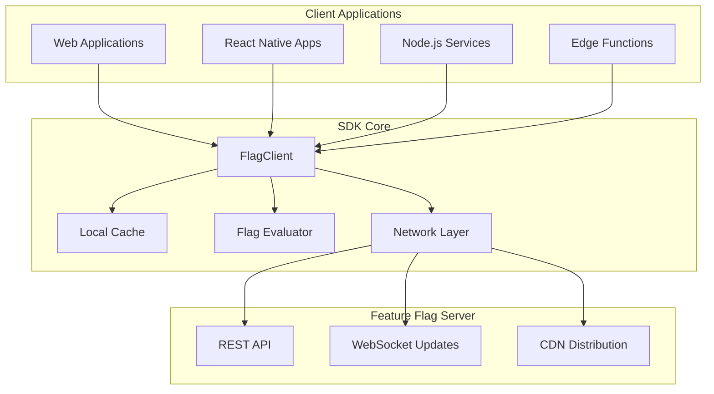
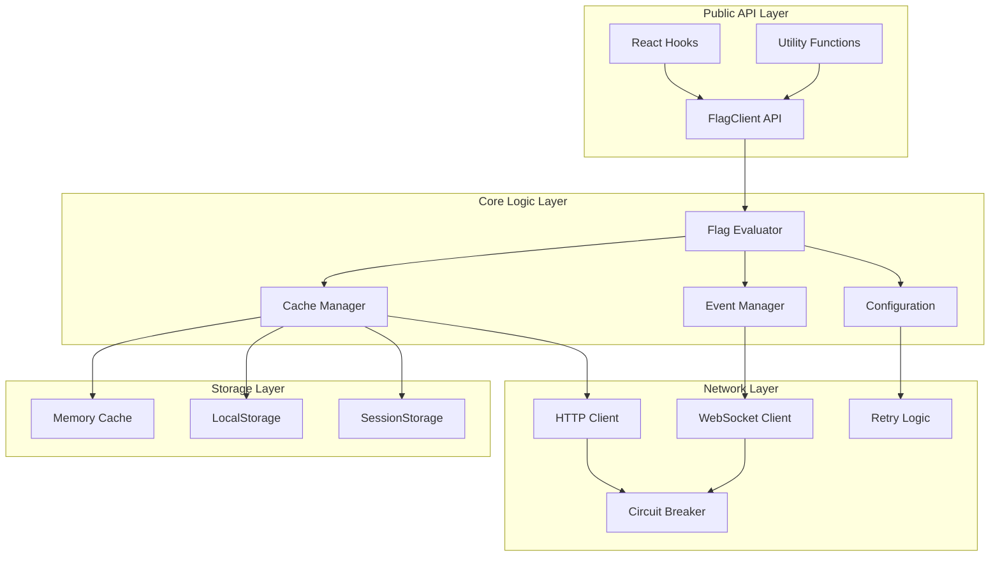

# Feature Flags JavaScript SDK

A lightweight, high-performance JavaScript/TypeScript SDK for integrating feature flags into client applications. This SDK provides a seamless interface for flag evaluation, caching, and real-time updates while maintaining zero external dependencies and universal compatibility.

## Table of Contents

- [Project Philosophy](#project-philosophy)
- [Architecture & Design](#architecture--design)
- [Project Structure](#project-structure)
- [Technology Stack](#technology-stack)
- [Development Practices](#development-practices)
- [API Design](#api-design)
- [Performance Optimizations](#performance-optimizations)
- [Testing Strategy](#testing-strategy)
- [Build System](#build-system)
- [Distribution Strategy](#distribution-strategy)
- [Best Practices](#best-practices)

## Project Philosophy

### Design Principles

The JavaScript SDK embodies several core principles that ensure optimal developer experience and runtime performance:

| Principle | Implementation | Benefit |
|-----------|----------------|---------|
| **Zero Dependencies** | Pure TypeScript implementation | Minimal bundle impact, no version conflicts |
| **Universal Compatibility** | Works in browsers, Node.js, and edge environments | Single SDK for all JavaScript runtimes |
| **Type Safety First** | Comprehensive TypeScript definitions | Compile-time error detection and IDE support |
| **Performance Optimized** | Efficient caching and minimal API calls | Fast flag evaluation with low latency |
| **Developer Experience** | Intuitive APIs with clear error messages | Reduced integration time and debugging |
| **Production Ready** | Robust error handling and fallback mechanisms | Reliable operation in production environments |

### SDK Goals & Use Cases

Our SDK addresses specific integration challenges in modern JavaScript applications:

#### Primary Use Cases



#### Integration Scenarios

| Scenario | Implementation | Benefits |
|----------|----------------|----------|
| **React Applications** | Hook-based integration with automatic re-renders | Seamless UI updates when flags change |
| **Vue.js Applications** | Reactive composition API integration | Reactive flag state management |
| **Node.js Services** | Server-side flag evaluation for backend logic | Consistent behavior across client/server |
| **Edge Computing** | Lightweight evaluation for CDN edge functions | Low-latency flag evaluation at the edge |
| **Mobile Apps** | React Native and Cordova compatibility | Native mobile app feature management |

### Business Value Proposition

The SDK enables several key business capabilities:

- **Rapid Feature Deployment**: Deploy features instantly without app store releases
- **Risk Mitigation**: Gradual rollouts with instant rollback capabilities
- **A/B Testing**: Statistical experimentation with user segmentation
- **Operational Control**: Runtime configuration without code changes
- **Performance Optimization**: Client-side caching reduces server load

## Architecture & Design

### SDK Architecture Overview



### Design Patterns Implementation

#### 1. Singleton Pattern for Client Instance

```typescript
class FlagClient {
  private static instance: FlagClient | null = null;
  private static instancePromise: Promise<FlagClient> | null = null;
  
  private constructor(private config: FlagClientConfig) {
    this.initialize();
  }
  
  static async getInstance(config?: FlagClientConfig): Promise<FlagClient> {
    if (FlagClient.instance) {
      return FlagClient.instance;
    }
    
    if (FlagClient.instancePromise) {
      return FlagClient.instancePromise;
    }
    
    if (!config) {
      throw new Error('Configuration required for first initialization');
    }
    
    FlagClient.instancePromise = (async () => {
      const client = new FlagClient(config);
      await client.ready();
      FlagClient.instance = client;
      return client;
    })();
    
    return FlagClient.instancePromise;
  }
  
  static reset(): void {
    FlagClient.instance = null;
    FlagClient.instancePromise = null;
  }
}
```

#### 2. Strategy Pattern for Cache Storage

```typescript
interface CacheStorage {
  get(key: string): Promise<string | null>;
  set(key: string, value: string, ttl?: number): Promise<void>;
  delete(key: string): Promise<void>;
  clear(): Promise<void>;
}

class MemoryCacheStorage implements CacheStorage {
  private cache = new Map<string, { value: string; expires?: number }>();
  
  async get(key: string): Promise<string | null> {
    const item = this.cache.get(key);
    if (!item) return null;
    
    if (item.expires && Date.now() > item.expires) {
      this.cache.delete(key);
      return null;
    }
    
    return item.value;
  }
  
  async set(key: string, value: string, ttl?: number): Promise<void> {
    const expires = ttl ? Date.now() + ttl * 1000 : undefined;
    this.cache.set(key, { value, expires });
  }
  
  async delete(key: string): Promise<void> {
    this.cache.delete(key);
  }
  
  async clear(): Promise<void> {
    this.cache.clear();
  }
}

class LocalStorageCacheStorage implements CacheStorage {
  private prefix = 'flag_cache_';
  
  async get(key: string): Promise<string | null> {
    if (typeof localStorage === 'undefined') return null;
    
    try {
      const item = localStorage.getItem(this.prefix + key);
      if (!item) return null;
      
      const parsed = JSON.parse(item);
      if (parsed.expires && Date.now() > parsed.expires) {
        localStorage.removeItem(this.prefix + key);
        return null;
      }
      
      return parsed.value;
    } catch {
      return null;
    }
  }
  
  async set(key: string, value: string, ttl?: number): Promise<void> {
    if (typeof localStorage === 'undefined') return;
    
    try {
      const expires = ttl ? Date.now() + ttl * 1000 : undefined;
      const item = JSON.stringify({ value, expires });
      localStorage.setItem(this.prefix + key, item);
    } catch {
      // Storage quota exceeded or other error - fail silently
    }
  }
  
  async delete(key: string): Promise<void> {
    if (typeof localStorage === 'undefined') return;
    localStorage.removeItem(this.prefix + key);
  }
  
  async clear(): Promise<void> {
    if (typeof localStorage === 'undefined') return;
    
    const keys = Object.keys(localStorage).filter(key => 
      key.startsWith(this.prefix)
    );
    keys.forEach(key => localStorage.removeItem(key));
  }
}

// Cache manager with strategy selection
class CacheManager {
  private storage: CacheStorage;
  
  constructor(config: CacheConfig) {
    this.storage = this.createStorage(config.type);
  }
  
  private createStorage(type: 'memory' | 'localStorage' | 'sessionStorage'): CacheStorage {
    switch (type) {
      case 'localStorage':
        return new LocalStorageCacheStorage();
      case 'sessionStorage':
        return new SessionStorageCacheStorage();
      default:
        return new MemoryCacheStorage();
    }
  }
}
```

#### 3. Observer Pattern for Event Management

```typescript
interface FlagEventListener {
  (event: FlagEvent): void;
}

interface FlagEvent {
  type: 'flag_updated' | 'flag_evaluated' | 'cache_updated' | 'error';
  flagKey?: string;
  data?: any;
  timestamp: number;
}

class EventManager {
  private listeners = new Map<string, Set<FlagEventListener>>();
  
  on(eventType: string, listener: FlagEventListener): () => void {
    if (!this.listeners.has(eventType)) {
      this.listeners.set(eventType, new Set());
    }
    
    this.listeners.get(eventType)!.add(listener);
    
    // Return unsubscribe function
    return () => {
      const listeners = this.listeners.get(eventType);
      if (listeners) {
        listeners.delete(listener);
        if (listeners.size === 0) {
          this.listeners.delete(eventType);
        }
      }
    };
  }
  
  emit(event: FlagEvent): void {
    const listeners = this.listeners.get(event.type);
    if (listeners) {
      listeners.forEach(listener => {
        try {
          listener(event);
        } catch (error) {
          console.error('Error in flag event listener:', error);
        }
      });
    }
    
    // Also emit to wildcard listeners
    const wildcardListeners = this.listeners.get('*');
    if (wildcardListeners) {
      wildcardListeners.forEach(listener => {
        try {
          listener(event);
        } catch (error) {
          console.error('Error in wildcard event listener:', error);
        }
      });
    }
  }
  
  removeAllListeners(eventType?: string): void {
    if (eventType) {
      this.listeners.delete(eventType);
    } else {
      this.listeners.clear();
    }
  }
}
```

## Project Structure

```
sdk-js/
├── src/
│   ├── client/                 # Core client implementation
│   │   ├── FlagClient.ts       # Main client class
│   │   ├── FlagEvaluator.ts    # Flag evaluation logic
│   │   ├── CacheManager.ts     # Caching implementation
│   │   ├── NetworkClient.ts    # HTTP/WebSocket networking
│   │   └── EventManager.ts     # Event system
│   ├── types/                  # TypeScript type definitions
│   │   ├── client.types.ts     # Client configuration types
│   │   ├── flag.types.ts       # Flag-related types
│   │   ├── cache.types.ts      # Cache configuration types
│   │   ├── network.types.ts    # Network-related types
│   │   └── index.ts            # Type exports
│   ├── utils/                  # Utility functions
│   │   ├── hash.ts             # Hashing utilities
│   │   ├── validation.ts       # Input validation
│   │   ├── environment.ts      # Environment detection
│   │   └── retry.ts            # Retry logic utilities
│   ├── integrations/           # Framework integrations
│   │   ├── react/              # React hooks and components
│   │   │   ├── useFlag.ts      # Flag evaluation hook
│   │   │   ├── useFlagClient.ts # Client management hook
│   │   │   └── FlagProvider.tsx # Context provider
│   │   ├── vue/                # Vue.js composition API
│   │   └── angular/            # Angular services and directives
│   ├── storage/                # Storage implementations
│   │   ├── MemoryStorage.ts    # In-memory storage
│   │   ├── LocalStorage.ts     # Browser localStorage
│   │   ├── SessionStorage.ts   # Browser sessionStorage
│   │   └── NodeStorage.ts      # Node.js file-based storage
│   ├── errors/                 # Custom error classes
│   │   ├── FlagError.ts        # Base error class
│   │   ├── NetworkError.ts     # Network-related errors
│   │   ├── ValidationError.ts  # Validation errors
│   │   └── ConfigError.ts      # Configuration errors
│   └── index.ts                # Main entry point
├── dist/                       # Compiled output
│   ├── esm/                    # ES modules
│   ├── cjs/                    # CommonJS modules
│   └── types/                  # TypeScript declarations
├── test/                       # Test files
│   ├── unit/                   # Unit tests
│   ├── integration/            # Integration tests
│   ├── fixtures/               # Test data
│   └── helpers/                # Test utilities
├── docs/                       # Documentation
│   ├── api/                    # API documentation
│   ├── guides/                 # Usage guides
│   └── examples/               # Code examples
├── scripts/                    # Build and utility scripts
│   ├── build.js                # Build script
│   ├── test.js                 # Test runner
│   └── release.js              # Release automation
├── rollup.config.mjs           # Rollup build configuration
├── jest.config.js              # Jest test configuration
├── tsconfig.json               # TypeScript configuration
├── package.json                # Package configuration
└── README.md                   # Package documentation
```

### Directory Organization Principles

#### 1. Feature-Based Organization
Core functionality is organized by feature rather than technical concerns:

```
client/
├── FlagClient.ts          # Main client orchestration
├── FlagEvaluator.ts       # Business logic for flag evaluation
├── CacheManager.ts        # Caching strategy and implementation
├── NetworkClient.ts       # Network communication
└── EventManager.ts        # Event handling and notifications
```

#### 2. Type-Safe Architecture
Comprehensive type definitions ensure compile-time safety:

```
types/
├── client.types.ts        # Client configuration and state
├── flag.types.ts          # Flag definitions and evaluation context
├── cache.types.ts         # Cache configuration and interfaces
├── network.types.ts       # Network request/response types
└── index.ts               # Consolidated type exports
```

#### 3. Framework Integration Strategy
Separate integration modules for different frameworks:

```
integrations/
├── react/
│   ├── useFlag.ts         # Hook for flag evaluation
│   ├── useFlagClient.ts   # Hook for client management
│   └── FlagProvider.tsx   # Context provider component
├── vue/
│   ├── useFlag.ts         # Composition API for flags
│   └── flagPlugin.ts      # Vue plugin for global access
└── angular/
    ├── flag.service.ts    # Injectable service
    └── flag.directive.ts  # Structural directive for conditional rendering
```

## Technology Stack

### Core Technologies

| Technology | Version | Purpose | Selection Rationale |
|------------|---------|---------|-------------------|
| **TypeScript** | 5.3.x | Primary Language | Type safety, modern JavaScript features, excellent tooling |
| **Rollup** | 4.x | Build Tool | Optimized for libraries, tree-shaking, multiple output formats |
| **Jest** | 29.x | Testing Framework | Comprehensive testing features, TypeScript support, mocking |
| **ESLint** | 9.x | Code Linting | Code quality enforcement, TypeScript integration |

### Build & Distribution

| Tool | Purpose | Configuration |
|------|---------|---------------|
| **Rollup** | Module bundling | Multiple output formats (ESM, CJS, UMD) |
| **TypeScript** | Type checking & compilation | Strict type checking, declaration generation |
| **Terser** | Code minification | Production bundle optimization |
| **Babel** | JavaScript transformation | Legacy browser compatibility |

### Development Tools

| Tool | Configuration File | Purpose |
|------|-------------------|---------|
| **Jest** | `jest.config.js` | Unit and integration testing |
| **ESLint** | `.eslintrc.js` | Code linting and style enforcement |
| **Prettier** | `.prettierrc` | Code formatting |
| **Husky** | `.husky/` | Git hooks for quality gates |
| **Rollup** | `rollup.config.mjs` | Build configuration |

## Development Practices

### Code Quality Standards

#### 1. TypeScript Configuration
Strict TypeScript settings ensure maximum type safety:

```json
{
  "compilerOptions": {
    "strict": true,
    "noImplicitAny": true,
    "strictNullChecks": true,
    "strictFunctionTypes": true,
    "noImplicitReturns": true,
    "noFallthroughCasesInSwitch": true,
    "noUncheckedIndexedAccess": true,
    "exactOptionalPropertyTypes": true,
    "noImplicitOverride": true,
    "noPropertyAccessFromIndexSignature": true,
    
    "target": "ES2020",
    "module": "ESNext",
    "moduleResolution": "node",
    "declaration": true,
    "declarationMap": true,
    "sourceMap": true,
    
    "lib": ["ES2020", "DOM", "DOM.Iterable"],
    "skipLibCheck": true,
    "forceConsistentCasingInFileNames": true
  }
}
```

#### 2. ESLint Configuration
Comprehensive linting rules for consistency:

```javascript
module.exports = {
  extends: [
    '@typescript-eslint/recommended',
    '@typescript-eslint/recommended-requiring-type-checking',
    'prettier'
  ],
  rules: {
    '@typescript-eslint/no-unused-vars': 'error',
    '@typescript-eslint/explicit-function-return-type': 'warn',
    '@typescript-eslint/no-explicit-any': 'error',
    '@typescript-eslint/prefer-readonly': 'error',
    '@typescript-eslint/prefer-nullish-coalescing': 'error',
    '@typescript-eslint/prefer-optional-chain': 'error',
    'prefer-const': 'error',
    'no-var': 'error',
    'no-console': 'warn'
  }
};
```

#### 3. Code Organization Standards

**Import Organization:**
```typescript
// 1. Node.js built-in modules (if any)
import { EventEmitter } from 'events';

// 2. Third-party libraries (none in this SDK)
// import { someLibrary } from 'some-library';

// 3. Internal modules (absolute paths)
import { FlagClient } from './client/FlagClient';
import { CacheManager } from './client/CacheManager';

// 4. Type imports (separate from value imports)
import type { FlagClientConfig, FlagEvaluationContext } from './types';

// 5. Relative imports
import { validateConfig } from './utils/validation';
```

**Naming Conventions:**
| Type | Convention | Example |
|------|------------|---------|
| **Classes** | PascalCase | `FlagClient`, `CacheManager` |
| **Interfaces** | PascalCase | `FlagClientConfig`, `CacheStorage` |
| **Types** | PascalCase | `FlagValue`, `EvaluationResult` |
| **Methods** | camelCase | `evaluateFlag()`, `updateCache()` |
| **Constants** | UPPER_SNAKE_CASE | `DEFAULT_TIMEOUT`, `MAX_RETRIES` |
| **Files** | PascalCase for classes, camelCase for utilities | `FlagClient.ts`, `validation.ts` |

### Core Implementation Patterns

#### 1. Client Class Structure

```typescript
/**
 * Main client class for feature flag evaluation and management
 */
export class FlagClient {
  private readonly config: Required<FlagClientConfig>;
  private readonly cacheManager: CacheManager;
  private readonly networkClient: NetworkClient;
  private readonly eventManager: EventManager;
  private readonly evaluator: FlagEvaluator;
  
  private isInitialized = false;
  private initializationPromise: Promise<void> | null = null;
  
  constructor(config: FlagClientConfig) {
    this.config = this.validateAndNormalizeConfig(config);
    this.cacheManager = new CacheManager(this.config.cache);
    this.networkClient = new NetworkClient(this.config.network);
    this.eventManager = new EventManager();
    this.evaluator = new FlagEvaluator(this.config.evaluation);
    
    this.setupEventListeners();
  }
  
  /**
   * Initialize the client and fetch initial flag data
   */
  async initialize(): Promise<void> {
    if (this.isInitialized) {
      return;
    }
    
    if (this.initializationPromise) {
      return this.initializationPromise;
    }
    
    this.initializationPromise = this.performInitialization();
    await this.initializationPromise;
  }
  
  /**
   * Evaluate a feature flag for the given context
   */
  async evaluateFlag(
    flagKey: string, 
    context: FlagEvaluationContext = {},
    defaultValue: boolean = false
  ): Promise<boolean> {
    try {
      // Validate inputs
      this.validateFlagKey(flagKey);
      this.validateContext(context);
      
      // Check cache first
      const cachedResult = await this.getCachedEvaluation(flagKey, context);
      if (cachedResult !== null) {
        this.emitEvent('flag_evaluated', { flagKey, result: cachedResult, source: 'cache' });
        return cachedResult;
      }
      
      // Fetch flag data if not cached
      const flagData = await this.getFlagData(flagKey);
      if (!flagData) {
        this.emitEvent('flag_evaluated', { flagKey, result: defaultValue, source: 'default' });
        return defaultValue;
      }
      
      // Evaluate flag
      const result = this.evaluator.evaluate(flagData, context);
      
      // Cache result
      await this.cacheEvaluationResult(flagKey, context, result);
      
      // Emit event
      this.emitEvent('flag_evaluated', { flagKey, result, source: 'evaluation' });
      
      return result;
    } catch (error) {
      this.handleEvaluationError(error, flagKey, defaultValue);
      return defaultValue;
    }
  }
  
  /**
   * Get multiple flag evaluations in a single call
   */
  async evaluateFlags(
    flagKeys: string[],
    context: FlagEvaluationContext = {},
    defaultValues: Record<string, boolean> = {}
  ): Promise<Record<string, boolean>> {
    const results: Record<string, boolean> = {};
    
    // Evaluate flags in parallel for better performance
    const evaluationPromises = flagKeys.map(async (flagKey) => {
      const defaultValue = defaultValues[flagKey] ?? false;
      const result = await this.evaluateFlag(flagKey, context, defaultValue);
      return { flagKey, result };
    });
    
    const evaluationResults = await Promise.allSettled(evaluationPromises);
    
    evaluationResults.forEach((result, index) => {
      const flagKey = flagKeys[index];
      if (result.status === 'fulfilled') {
        results[result.value.flagKey] = result.value.result;
      } else {
        results[flagKey] = defaultValues[flagKey] ?? false;
        this.handleEvaluationError(result.reason, flagKey, defaultValues[flagKey] ?? false);
      }
    });
    
    return results;
  }
  
  private async performInitialization(): Promise<void> {
    try {
      // Fetch initial flag data
      await this.fetchInitialFlags();
      
      // Setup real-time updates if configured
      if (this.config.realTimeUpdates) {
        await this.setupRealTimeUpdates();
      }
      
      this.isInitialized = true;
      this.emitEvent('client_initialized', {});
    } catch (error) {
      this.emitEvent('initialization_error', { error });
      throw new FlagError('Failed to initialize flag client', 'INITIALIZATION_ERROR', error);
    }
  }
  
  private validateAndNormalizeConfig(config: FlagClientConfig): Required<FlagClientConfig> {
    // Validation logic with detailed error messages
    if (!config.apiKey) {
      throw new ConfigError('API key is required');
    }
    
    if (!config.baseUrl) {
      throw new ConfigError('Base URL is required');
    }
    
    // Normalize and set defaults
    return {
      apiKey: config.apiKey,
      baseUrl: config.baseUrl.replace(/\/$/, ''), // Remove trailing slash
      timeout: config.timeout ?? 5000,
      retryAttempts: config.retryAttempts ?? 3,
      cache: {
        enabled: config.cache?.enabled ?? true,
        ttl: config.cache?.ttl ?? 300, // 5 minutes
        storage: config.cache?.storage ?? 'memory',
        ...config.cache
      },
      network: {
        timeout: config.network?.timeout ?? config.timeout ?? 5000,
        retryAttempts: config.network?.retryAttempts ?? config.retryAttempts ?? 3,
        ...config.network
      },
      evaluation: {
        enableLocalEvaluation: config.evaluation?.enableLocalEvaluation ?? true,
        ...config.evaluation
      },
      realTimeUpdates: config.realTimeUpdates ?? false
    };
  }
}
```

#### 2. Error Handling Strategy

```typescript
// Base error class for all SDK errors
export class FlagError extends Error {
  constructor(
    message: string,
    public readonly code: string,
    public readonly cause?: unknown
  ) {
    super(message);
    this.name = 'FlagError';
    
    // Maintain proper stack trace
    if (Error.captureStackTrace) {
      Error.captureStackTrace(this, FlagError);
    }
  }
}

// Specific error types
export class NetworkError extends FlagError {
  constructor(message: string, cause?: unknown) {
    super(message, 'NETWORK_ERROR', cause);
    this.name = 'NetworkError';
  }
}

export class ValidationError extends FlagError {
  constructor(message: string, public readonly field?: string) {
    super(message, 'VALIDATION_ERROR');
    this.name = 'ValidationError';
  }
}

export class ConfigError extends FlagError {
  constructor(message: string) {
    super(message, 'CONFIG_ERROR');
    this.name = 'ConfigError';
  }
}

// Error handling in client methods
class FlagClient {
  private handleEvaluationError(
    error: unknown, 
    flagKey: string, 
    defaultValue: boolean
  ): void {
    let errorMessage = 'Unknown error during flag evaluation';
    let errorCode = 'UNKNOWN_ERROR';
    
    if (error instanceof FlagError) {
      errorMessage = error.message;
      errorCode = error.code;
    } else if (error instanceof Error) {
      errorMessage = error.message;
    }
    
    // Log error for debugging
    console.warn(`Flag evaluation error for '${flagKey}':`, errorMessage);
    
    // Emit error event for monitoring
    this.emitEvent('evaluation_error', {
      flagKey,
      error: errorMessage,
      code: errorCode,
      defaultValue
    });
    
    // Update error metrics if available
    this.updateErrorMetrics(errorCode, flagKey);
  }
  
  private updateErrorMetrics(errorCode: string, flagKey: string): void {
    // Implementation for error tracking/metrics
    // Could integrate with analytics services
  }
}
```

#### 3. Caching Implementation

```typescript
interface CacheEntry<T> {
  value: T;
  timestamp: number;
  ttl: number;
}

class CacheManager {
  private storage: CacheStorage;
  private readonly config: CacheConfig;
  
  constructor(config: CacheConfig) {
    this.config = config;
    this.storage = this.createStorage(config.storage);
  }
  
  async get<T>(key: string): Promise<T | null> {
    if (!this.config.enabled) {
      return null;
    }
    
    try {
      const cached = await this.storage.get(key);
      if (!cached) {
        return null;
      }
      
      const entry: CacheEntry<T> = JSON.parse(cached);
      
      // Check if entry has expired
      if (Date.now() - entry.timestamp > entry.ttl * 1000) {
        await this.storage.delete(key);
        return null;
      }
      
      return entry.value;
    } catch (error) {
      console.warn('Cache get error:', error);
      return null;
    }
  }
  
  async set<T>(key: string, value: T, ttl?: number): Promise<void> {
    if (!this.config.enabled) {
      return;
    }
    
    try {
      const entry: CacheEntry<T> = {
        value,
        timestamp: Date.now(),
        ttl: ttl ?? this.config.ttl
      };
      
      await this.storage.set(key, JSON.stringify(entry));
    } catch (error) {
      console.warn('Cache set error:', error);
      // Don't throw - caching failures shouldn't break functionality
    }
  }
  
  async invalidate(pattern: string): Promise<void> {
    try {
      // For simple implementations, we might need to clear all
      // More sophisticated implementations could support pattern matching
      if (pattern === '*') {
        await this.storage.clear();
      } else {
        // Implementation depends on storage capabilities
        await this.storage.delete(pattern);
      }
    } catch (error) {
      console.warn('Cache invalidation error:', error);
    }
  }
  
  generateKey(flagKey: string, context: FlagEvaluationContext): string {
    // Create a deterministic cache key based on flag and context
    const contextHash = this.hashContext(context);
    return `flag:${flagKey}:${contextHash}`;
  }
  
  private hashContext(context: FlagEvaluationContext): string {
    // Simple hash implementation for context
    const normalized = {
      userId: context.userId,
      userSegments: context.userSegments?.sort(),
      customAttributes: this.sortObject(context.customAttributes || {})
    };
    
    const str = JSON.stringify(normalized);
    return this.simpleHash(str);
  }
  
  private sortObject(obj: Record<string, any>): Record<string, any> {
    return Object.keys(obj)
      .sort()
      .reduce((result, key) => {
        result[key] = obj[key];
        return result;
      }, {} as Record<string, any>);
  }
  
  private simpleHash(str: string): string {
    let hash = 0;
    for (let i = 0; i < str.length; i++) {
      const char = str.charCodeAt(i);
      hash = ((hash << 5) - hash) + char;
      hash = hash & hash; // Convert to 32-bit integer
    }
    return Math.abs(hash).toString(36);
  }
}
```